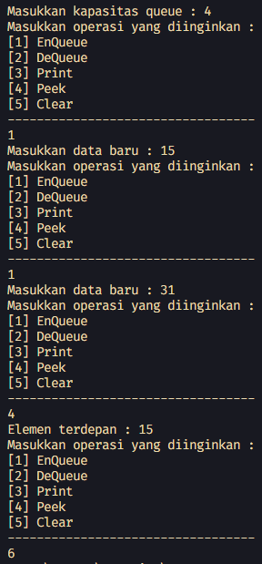
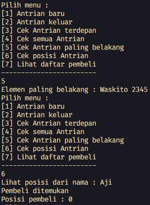

# <p align="center">LAPORAN JOBSHEET X - QUEUE</p>

### **IDENTITAS MAHASISWA**
**Nama :** Haikal Muhammad Rafli<br>
**NIM :** 2341720008<br>
**Kelas :** TI-1B<br>
**Absen :** 14

## PRAKTIKUM

### **1.0 Percobaan 1**

### 1.1 Kode Percobaan :

``Queue.java`` <br>
```java
package praktikum1;

public class Queue {
    int[] data;
    int front;
    int rear;
    int size;
    int max;

    public Queue(int n) {
        max = n;
        data = new int[max];
        size = 0;
        front = rear = -1;
    }

    public boolean isEmpty() {
        if (size == 0) {
            return true;
        } else {
            return false;
        }
    }

    public boolean isFull() {
        if (size == max) {
            return true;
        } else {
            return false;
        }
    }

    public void peek() {
        if (!isEmpty()) {
            System.out.println("Elemen terdepan : " + data[front]);
        } else {
            System.out.println("Queue masih kosong");
        }
    }

    public void print() {
        if (isEmpty()) {
            System.out.println("Queue masih kosong");
        } else {
            int i = front;
            while (i != rear) {
                System.out.print(data[i] + " ");
                i = (i + i) % max;
            }
            System.out.println(data[i] + " ");
            System.out.println("Jumlah elemen = " + size);
        }
    }

    public void clear() {
        if (!isEmpty()) {
            front = rear = -1;
            size = 0;
            System.out.println("Queue berhasil dikosongkan");
        } else {
            System.out.println("Queue masih kosong");
        }
    }

    public void enQueue(int dt) {
        if (isFull()) {
            System.out.println("Queue sudah penuh");
        } else {
            if (isEmpty()) {
                front = rear = 0;
            } else {
                if (rear == max - 1) {
                    rear = 0;
                } else {
                    rear++;
                }
            }
        }

        data[rear] = dt;
        size++;
    }

    public int deQueue() {
        int dt = 0;
        if (isEmpty()) {
            System.out.println("Queue masih kosong");
        } else {
            dt = data[front];
            size--;

            if (isEmpty()) {
                front = rear = -1;
            } else {
                if (front == max - 1) {
                    front = 0;
                } else {
                    front++;
                }
            }
        }

        return dt;
    }
}
```

``QueueMain.java`` <br>
```java
package praktikum1;

import java.util.Scanner;

public class QueueMain {

    public static void menu() {
        System.out.println("Masukkan operasi yang diinginkan : ");
        System.out.println("[1] EnQueue");
        System.out.println("[2] DeQueue");
        System.out.println("[3] Print");
        System.out.println("[4] Peek");
        System.out.println("[5] Clear");
        System.out.println("----------------------------------");
    }

    public static void main(String[] args) {

        Scanner sc = new Scanner(System.in);

        System.out.print("Masukkan kapasitas queue : ");
        int n = sc.nextInt();
        sc.nextLine();

        Queue Q = new Queue(n);
        int pilih;

        do {
            menu();
            pilih = sc.nextInt();
            switch (pilih) {
                case 1:
                    System.out.print("Masukkan data baru : ");
                    int dataMasuk = sc.nextInt();
                    Q.enQueue(dataMasuk);
                    break;

                case 2:
                    int dataKeluar = Q.deQueue();
                    if (dataKeluar != 0) {
                        System.out.println("Data yang dikeluarkan : " + dataKeluar);
                        break;
                    }

                case 3:
                    Q.print();
                    break;

                case 4:
                    Q.peek();
                    break;

                case 5:
                    Q.clear();
                    break;
            }
        } while (pilih == 1 || pilih == 2 || pilih == 3 || pilih == 4 || pilih == 5);

        sc.close();
    }
}
```

### 1.2 Verifikasi Hasil Percobaan :



### 1.3 Pertanyaan Dan Jawaban :

1. Pada konstruktor, mengapa nilai awal atribut front dan rear bernilai -1, sementara atribut size bernilai 0? <br>
**Jawaban :** <br> ``Karena pada awal pembuatan queue isi arraynya masih kosong, sehingga sizenya diberi nilai 0 dan front & rearnya diberi nilai -1 karena tidak menunjuk ke data manapun``

2. Pada method Enqueue, jelaskan maksud dan kegunaan dari potongan kode berikut! <br>
   ```java
    if (rear == max - 1){
        rear = 0;
   ```
    **Jawaban :** <br> ``Kegunaannya adalah untuk mengecek apakah rearnya menunjuk index paling akhir dari array. Jika iya, maka data barunya akan disimpan di posisi index ke 0 dan rearnya juga akan menunjuk di index 0``

3. Pada method Dequeue, jelaskan maksud dan kegunaan dari potongan kode berikut! <br>
    ```java
    if (front == max - 1){
        front = 0;
   ```
    **Jawaban :** <br> ``Kegunaannya adalah untuk mengecek apakah frontnya menunjuk index paling akhir dari array. Jika iya, maka data tersebut akan dikeluarkan dan posisi frontnya akan berpindah index ke 0``

4. Pada method print, mengapa pada proses perulangan variabel i tidak dimulai dari 0 (int i=0), melainkan int i=front? <br>
**Jawaban :** <br> ``Karena jika queue dilakukan penghapusan maka data paling depan (front) akan bergeser ke indeks berikutnya. Sehingga front tidak selalu ada di indeks ke 0``

5. Perhatikan kembali method print, jelaskan maksud dari potongan kode berikut! <br>
   ```java
    i = ( i + 1 ) % max;
   ```
    **Jawaban :** <br> ``Maksud dari potongan kode tersebut digunakan untuk memastikan (i + 1) melebihi max (ukuran maksimum array). jika i == max, maka i akan kembali ke 0 (karena modulus dengan max akan menghasilkan sisa pembagian antara 0 sampai max - 1).``

6. Tunjukkan potongan kode program yang merupakan queue overflow! <br>
**Jawaban :** <br> ``Ditunjukkan pada method enQueue : ``
    ```java
    if (isFull()) {
            System.out.println("Queue sudah penuh");
        }
    ```

7. Pada saat terjadi queue overflow dan queue underflow, program tersebut tetap dapat berjalan dan hanya menampilkan teks informasi. Lakukan modifikasi program sehingga pada saat terjadi queue overflow dan queue underflow, program dihentikan! <br>
**Jawaban :** <br> ``Modifikasi program : ``

    ```java
    public void enQueue(int dt) {
        if (isFull()) {
            System.out.println("Queue sudah penuh");
            System.exit(0);
        } else {
            if (isEmpty()) {
                front = rear = 0;
            } else {
                if (rear == max - 1) {
                    rear = 0;
                } else {
                    rear++;
                }
            }
        }

        data[rear] = dt;
        size++;
    }

    public int deQueue() {
        int dt = 0;
        if (isEmpty()) {
            System.out.println("Queue masih kosong");
            System.exit(0);
        } else {
            dt = data[front];
            size--;

            if (isEmpty()) {
                front = rear = -1;
            } else {
                if (front == max - 1) {
                    front = 0;
                } else {
                    front++;
                }
            }
        }

        return dt;
    }
    ```

<br><hr>

### **2.0 Percobaan 2: Konversi Kode Barang ke Biner**

### 2.1 Kode Percobaan :

``Nasabah.java`` <br>
```java
package praktikum2;

public class Nasabah {
    String norek;
    String nama;
    String alamat;
    int umur;
    double saldo;

    Nasabah(String norek, String nama, String alamat, int umur, double saldo) {
        this.norek = norek;
        this.nama = nama;
        this.alamat = alamat;
        this.umur = umur;
        this.saldo = saldo;
    }

    Nasabah() {

    }
}
```

``Queue.java`` <br>
```java
package praktikum2;

public class Queue {
    Nasabah[] data;
    int front;
    int rear;
    int size;
    int max;

    public Queue(int n) {
        max = n;
        data = new Nasabah[max];
        size = 0;
        front = rear = -1;
    }

    public boolean isEmpty() {
        if (size == 0) {
            return true;
        } else {
            return false;
        }
    }

    public boolean isFull() {
        if (size == max) {
            return true;
        } else {
            return false;
        }
    }

    public void peek() {
        if (!isEmpty()) {
            System.out.println("Elemen terdepan : " + data[front].norek + " " + data[front].nama + " "
                    + data[front].alamat + " " + data[front].umur + " " + data[front].saldo);
        } else {
            System.out.println("Queue masih kosong");
        }
    }

    public void print() {
        if (isEmpty()) {
            System.out.println("Queue masih kosong");
        } else {
            int i = front;
            while (i != rear) {
                System.out.println(data[i].norek + " " + data[i].nama + " "
                        + data[i].alamat + " " + data[i].umur + " " + data[i].saldo);
                i = (i + 1) % max;
            }
            System.out.println(data[i].norek + " " + data[i].nama + " "
                    + data[i].alamat + " " + data[i].umur + " " + data[i].saldo);
            System.out.println("Jumlah elemen = " + size);
        }
    }

    public void clear() {
        if (!isEmpty()) {
            front = rear = -1;
            size = 0;
            System.out.println("Queue berhasil dikosongkan");
        } else {
            System.out.println("Queue masih kosong");
        }
    }

    public void enQueue(Nasabah dt) {
        if (isFull()) {
            System.out.println("Queue sudah penuh");
        } else {
            if (isEmpty()) {
                front = rear = 0;
            } else {
                if (rear == max - 1) {
                    rear = 0;
                } else {
                    rear++;
                }
            }
        }

        data[rear] = dt;
        size++;
    }

    public Nasabah deQueue() {
        Nasabah dt = new Nasabah();
        if (isEmpty()) {
            System.out.println("Queue masih kosong");
        } else {
            dt = data[front];
            size--;

            if (isEmpty()) {
                front = rear = -1;
            } else {
                if (front == max - 1) {
                    front = 0;
                } else {
                    front++;
                }
            }
        }

        return dt;
    }
}
```

``QueueMain.java`` <br>
```java
package praktikum2;

import java.util.Scanner;

public class QueueMain {

    public static void menu() {
        System.out.println("Pilih menu : ");
        System.out.println("[1] Antrian baru");
        System.out.println("[2] Antrian keluar");
        System.out.println("[3] Cek Antrian terdepan");
        System.out.println("[4] Cek semua Antrian");
        System.out.println("------------------------");
    }

    public static void main(String[] args) {

        Scanner sc = new Scanner(System.in);

        System.out.print("Masukkan kapasitas queue : ");
        int jumlah = sc.nextInt();
        sc.nextLine();
        Queue antri = new Queue(jumlah);

        int pilih;
        do {
            menu();
            pilih = sc.nextInt();
            sc.nextLine();
            switch (pilih) {
                case 1:
                    System.out.print("No Rekening : ");
                    String norek = sc.nextLine();
                    System.out.print("Nama : ");
                    String nama = sc.nextLine();
                    System.out.print("Alamat : ");
                    String alamat = sc.nextLine();
                    System.out.print("Umur : ");
                    int umur = sc.nextInt();
                    sc.nextLine();
                    System.out.print("Saldo : ");
                    double saldo = sc.nextDouble();
                    Nasabah nb = new Nasabah(norek, nama, alamat, umur, saldo);
                    sc.nextLine();
                    antri.enQueue(nb);
                    break;

                case 2:
                    Nasabah data = antri.deQueue();
                    if (!"".equals(data.norek) && !"".equals(data.nama) && !"".equals(data.alamat) && data.umur != 0
                            && data.saldo != 0) {
                        System.out.println("Atrian yang keluar : " + data.norek + " " + data.nama + " "
                                + data.alamat + " " + data.umur + " " + data.saldo);
                        break;
                    }

                case 3:
                    antri.peek();
                    break;

                case 4:
                    antri.print();
                    break;

            }
        } while (pilih == 1 || pilih == 2 || pilih == 3 || pilih == 4);

        sc.close();
    }
}
```

### 2.2 Verifikasi Hasil Percobaan :


### 2.3 Pertanyaan Dan Jawaban :

1. Pada class QueueMain, jelaskan fungsi IF pada potongan kode program berikut! <br>
   ```java
    if (!"".equals(data.norek) && !"".equals(data.nama) && !"".equals(data.alamat) && data.umur != 0
                            && data.saldo != 0) {
                        System.out.println("Atrian yang keluar : " + data.norek + " " + data.nama + " "
                                + data.alamat + " " + data.umur + " " + data.saldo);
                        break;
                    }
   ```
    **Jawaban :** <br> ``Fungsinya adalah untuk mengecek apakah atribut dari data tersebut tidak ada yang kosong. Jika tidak maka akan menampilkan atribut dari data yang dikeluarkan``

2. Lakukan modifikasi program dengan menambahkan method baru bernama peekRear pada class Queue yang digunakan untuk mengecek antrian yang berada di posisi belakang! Tambahkan pula daftar menu 5. Cek Antrian paling belakang pada class QueueMain sehingga method peekReardapat dipanggil! <br>
**Jawaban :** <br> ``Modifikasi program :``

    ```java
    // Queue.java
    public void peekRear() {
        if (!isEmpty()) {
            System.out.println("Elemen terbelakang : " + data[rear].norek + " " + data[rear].nama + " "
                    + data[rear].alamat + " " + data[rear].umur + " " + data[rear].saldo);
        } else {
            System.out.println("Queue masih kosong");
        }
    }


    //QueueMain.java
    public static void menu() {
        System.out.println("Pilih menu : ");
        System.out.println("[1] Antrian baru");
        System.out.println("[2] Antrian keluar");
        System.out.println("[3] Cek Antrian terdepan");
        System.out.println("[4] Cek semua Antrian");
        System.out.println("[5] Cek Antrian paling belakang");
        System.out.println("------------------------");
    }

    public static void main(String[] args) {

        Scanner sc = new Scanner(System.in);

        System.out.print("Masukkan kapasitas queue : ");
        int jumlah = sc.nextInt();
        sc.nextLine();
        Queue antri = new Queue(jumlah);

        int pilih;
        do {
            menu();
            pilih = sc.nextInt();
            sc.nextLine();
            switch (pilih) {
                case 1:
                    System.out.print("No Rekening : ");
                    String norek = sc.nextLine();
                    System.out.print("Nama : ");
                    String nama = sc.nextLine();
                    System.out.print("Alamat : ");
                    String alamat = sc.nextLine();
                    System.out.print("Umur : ");
                    int umur = sc.nextInt();
                    sc.nextLine();
                    System.out.print("Saldo : ");
                    double saldo = sc.nextDouble();
                    Nasabah nb = new Nasabah(norek, nama, alamat, umur, saldo);
                    sc.nextLine();
                    antri.enQueue(nb);
                    break;

                case 2:
                    Nasabah data = antri.deQueue();
                    if (!"".equals(data.norek) && !"".equals(data.nama) && !"".equals(data.alamat) && data.umur != 0
                            && data.saldo != 0) {
                        System.out.println("Atrian yang keluar : " + data.norek + " " + data.nama + " "
                                + data.alamat + " " + data.umur + " " + data.saldo);
                        break;
                    }

                case 3:
                    antri.peek();
                    break;

                case 4:
                    antri.print();
                    break;

                case 5:
                    antri.peekRear();
                    break;

            }
        } while (pilih == 1 || pilih == 2 || pilih == 3 || pilih == 4);

        sc.close();
    }
    ```

<br><hr>

### **3.0 Tugas**

### 3.1 Kode Program :

``Pembeli.java`` <br>
```java
package tugas;

public class Pembeli {
    String nama;
    int noHP;

    Pembeli(String nama, int noHP) {
        this.nama = nama;
        this.noHP = noHP;
    }

    Pembeli() {
    }
}
```

``Queue.java`` <br>
```java
package tugas;

public class Queue {
    Pembeli[] data;
    int front;
    int rear;
    int size;
    int max;

    public Queue(int n) {
        max = n;
        data = new Pembeli[max];
        size = 0;
        front = rear = -1;
    }

    public boolean isEmpty() {
        if (size == 0) {
            return true;
        } else {
            return false;
        }
    }

    public boolean isFull() {
        if (size == max) {
            return true;
        } else {
            return false;
        }
    }

    public void enQueue(Pembeli dt) {
        if (isFull()) {
            System.out.println("Queue sudah penuh");
        } else {
            if (isEmpty()) {
                front = rear = 0;
            } else {
                if (rear == max - 1) {
                    rear = 0;
                } else {
                    rear++;
                }
            }
        }

        data[rear] = dt;
        size++;
    }

    public Pembeli deQueue() {
        Pembeli dt = new Pembeli();
        if (isEmpty()) {
            System.out.println("Queue masih kosong");
        } else {
            dt = data[front];
            size--;

            if (isEmpty()) {
                front = rear = -1;
            } else {
                if (front == max - 1) {
                    front = 0;
                } else {
                    front++;
                }
            }
        }

        return dt;
    }

    public void print() {
        if (isEmpty()) {
            System.out.println("Queue masih kosong");
        } else {
            int i = front;
            while (i != rear) {
                System.out.println(data[i].nama + " " + data[i].noHP);
                i = (i + 1) % max;
            }
            System.out.println(data[i].nama + " " + data[i].noHP);
            System.out.println("Jumlah pembeli = " + size);
        }
    }

    public void peek() {
        if (!isEmpty()) {
            System.out.println("Elemen terdepan : " + data[front].nama + " " + data[front].noHP);
        } else {
            System.out.println("Queue masih kosong");
        }
    }

    public void peekRear() {
        if (!isEmpty()) {
            System.out.println("Elemen paling belakang : " + data[rear].nama + " " + data[rear].noHP);
        } else {
            System.out.println("Queue masih kosong");
        }
    }

    public void peekPosition(String nama) {
        boolean isFound = false;
        if (!isEmpty()) {
            for (int i = 0; i < data.length; i++) {
                if (nama.equals(data[i].nama)) {
                    System.out.println("Pembeli ditemukan");
                    System.out.println("Posisi pembeli : " + i);
                    isFound = true;
                    break;
                }
            }

            if (!isFound) {
                System.out.println("Pembeli tidak ditemukan");
            }
        } else {
            System.out.println("Queue masih kosong");
        }
    }

    public void daftarPembeli() {
        if (isEmpty()) {
            System.out.println("Queue masih kosong");
        } else {
            int i = front;
            while (i != rear) {
                System.out.println(data[i].nama + " " + data[i].noHP);
                i = (i + 1) % max;
            }
            System.out.println(data[i].nama + " " + data[i].noHP);
            System.out.println("Jumlah pembeli = " + size);
        }
    }
}
```

``QueueMain.java`` <br>
```java
package tugas;

import java.util.Scanner;

public class QueueMain {
    public static void menu() {
        System.out.println("Pilih menu : ");
        System.out.println("[1] Antrian baru");
        System.out.println("[2] Antrian keluar");
        System.out.println("[3] Cek Antrian terdepan");
        System.out.println("[4] Cek semua Antrian");
        System.out.println("[5] Cek Antrian paling belakang");
        System.out.println("[6] Cek posisi Antrian");
        System.out.println("[7] Lihat daftar pembeli");
        System.out.println("------------------------");
    }

    public static void main(String[] args) {

        Scanner sc = new Scanner(System.in);

        System.out.print("Masukkan kapasitas queue : ");
        int jumlah = sc.nextInt();
        sc.nextLine();
        Queue antri = new Queue(jumlah);

        int pilih;
        do {
            menu();
            pilih = sc.nextInt();
            sc.nextLine();
            switch (pilih) {
                case 1:
                    System.out.print("Nama : ");
                    String nama = sc.nextLine();
                    System.out.print("No HP : ");
                    int noHP = sc.nextInt();
                    sc.nextLine();
                    Pembeli nb = new Pembeli(nama, noHP);
                    antri.enQueue(nb);
                    break;

                case 2:
                    Pembeli data = antri.deQueue();
                    if (!"".equals(data.nama) && data.noHP != 0) {
                        System.out.println("Atrian yang keluar : " + data.nama + " " + data.noHP);
                        break;
                    }

                case 3:
                    antri.peek();
                    break;

                case 4:
                    antri.print();
                    break;

                case 5:
                    antri.peekRear();
                    break;

                case 6:
                    System.out.print("Lihat posisi dari nama : ");
                    antri.peekPosition(sc.nextLine());
                    break;

                case 7:
                    antri.daftarPembeli();
                    break;

            }
        } while (pilih == 1 || pilih == 2 || pilih == 3 || pilih == 4 || pilih == 5 || pilih == 6 || pilih == 7);

        sc.close();
    }
}
```

### 3.2 Verifikasi Hasil Percobaan :




