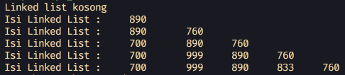
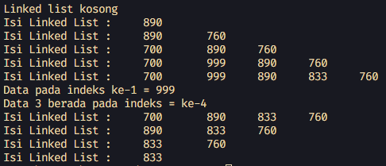
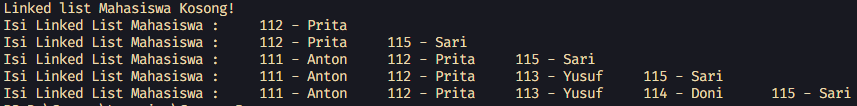
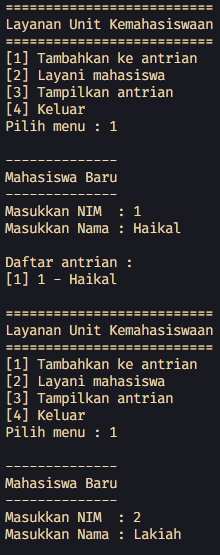
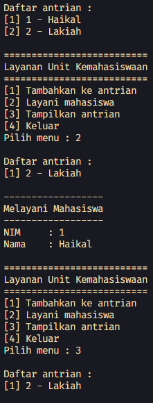

# <p align="center">LAPORAN JOBSHEET IX - LINKED LIST</p>

### **IDENTITAS MAHASISWA**
**Nama :** Haikal Muhammad Rafli<br>
**NIM :** 2341720008<br>
**Kelas :** TI-1B<br>
**Absen :** 14

## PRAKTIKUM

### **1.0 Percobaan 1**

### 1.1 Kode Percobaan :

``Node.java`` <br>
```java
public class Node {
    int data;
    Node next;

    Node(int nilai, Node berikutnya) {
        data = nilai;
        next = berikutnya;
    }
}
```

``SingleLinkedList.java`` <br>
```java
public class SingleLinkedList {
    Node head, tail;

    boolean isEmpty() {
        return head == null;
    }

    void print() {
        if (!isEmpty()) {
            Node tmp = head;

            System.out.print("Isi Linked List :     ");
            while (tmp != null) {
                System.out.print(tmp.data + "\t");
                tmp = tmp.next;
            }
            System.out.println("");
        } else {
            System.out.println("Linked list kosong");
        }
    }

    void addFirst(int input) {
        Node ndInput = new Node(input, null);

        if (!isEmpty()) {
            ndInput.next = head;
            head = ndInput;
        } else {
            head = ndInput;
            tail = ndInput;
        }
    }

    void addLast(int input) {
        Node ndInput = new Node(input, null);

        if (!isEmpty()) {
            tail.next = ndInput;
            tail = ndInput;
        } else {
            head = ndInput;
            tail = ndInput;
        }
    }

    void insertAfter(int key, int input) {
        Node ndInput = new Node(input, null);
        Node temp = head;

        do {
            if (temp.data == key) {
                ndInput.next = temp.next;
                temp.next = ndInput;

                if (ndInput.next == null) {
                    tail = ndInput;
                    break;
                }
            }

            temp = temp.next;
        } while (temp == null);
    }

    void insertAt(int index, int input) {

        if (index < 0) {
            System.out.println("Index tidak boleh kurang dari 0!");
        } else if (index == 0) {
            addFirst(input);
        } else {
            Node temp = head;

            for (int i = 0; i < index - 1; i++) {
                temp = temp.next;
            }

            temp.next = new Node(input, temp.next);
            if (temp.next.next == null) {
                tail = temp.next;
            }
        }
    }
}
```

``SLLMain.java`` <br>
```java
public class SLLMain {

    public static void main(String[] args) {
        SingleLinkedList singLL = new SingleLinkedList();
        singLL.print();
        singLL.addFirst(890);
        singLL.print();
        singLL.addLast(760);
        singLL.print();
        singLL.addFirst(700);
        singLL.print();
        singLL.insertAfter(700, 999);
        singLL.print();
        singLL.insertAt(3, 833);
        singLL.print();
    }
}
```

### 1.2 Verifikasi Hasil Percobaan



### 1.3 Pertanyaan Dan Jawaban :

1. Mengapa hasil compile kode program di baris pertama menghasilkan “Linked List Kosong”? <br>
**Jawaban :** <br> ``Karena pada saat method print() dijalankan, linked list yang akan diprint itu masih kosong. Sehingga pengecekan if else pada method tersebut menjalankan print "Linked List Kosong"``

2. Jelaskan kegunaan variable temp secara umum pada setiap method! <br>
**Jawaban :** <br> ``Untuk menelusuri setiap node mulai dari head hingga mencapai tail``

3. Perhatikan class SingleLinkedList, pada method insertAt Jelaskan kegunaan kode berikut!
    ```java
    if(temp.next.next == null) tail = temp.next;
    ```
    **Jawaban :** <br> ``Kegunaannya adalah jika kondisi node berikutnya setelah temp itu null, maka node setelah temp itu dijadikan sebagai tail dari linked list``

<br><hr>

### **2.0 Percobaan 2: Modifikasi Elemen pada Single Linked List**

### 2.1 Modifikasi Kode Percobaan :

``SingleLinkedList.java`` <br>
```java
int getData(int index) {
    Node tmp = head;

    for (int i = 0; i < index; i++) {
        tmp = tmp.next;
    }
    return tmp.data;
}

int indexOf(int key) {
    Node tmp = head;
    int index = 0;

    while (tmp != null && tmp.data != key) {
        tmp = tmp.next;
        index++;
    }

    if (tmp != null) {
        return index;
    } else {
        return -1;
    }
}

void removeFirst() {
    if (!isEmpty()) {
        head = head.next;
    } else if (head == tail) {
        head = tail = null;
    } else {
        System.out.println("Linked list masih kosong, " + "tidak dapat dihapus!");
    }
}

void removeLast() {
    if (!isEmpty()) {
        Node temp = head;

        while (temp.next != tail) {
            temp = temp.next;
        }

        temp.next = null;
        tail = temp.next;
    }
}

void remove(int key) {
    if (!isEmpty()) {
        Node temp = head;

        while (temp != null) {
            if (temp.data == key && temp == head) {
                removeFirst();
                break;
            } else if (temp.next.data == key) {
                temp.next = temp.next.next;

                if (temp.next == null) {
                    tail = temp;
                }

                break;
            }

            temp = temp.next;
        }
    }
}

void removeAt(int index) {
    if (index == 0) {
        removeFirst();
    } else {
        Node temp = head;

        for (int i = 0; i < index - 1; i++) {
            temp = temp.next;
        }

        temp.next = temp.next.next;

        if (temp.next == null) {
            tail = temp;
        }
    }
}
```

``SLLMain.java`` <br>
```java
System.out.println("Data pada indeks ke-1 = " + singLL.getData(1));
System.out.println("Data 3 berada pada indeks = ke-" + singLL.indexOf(760));

singLL.remove(999);
singLL.print();
singLL.removeAt(0);
singLL.print();
singLL.removeFirst();
singLL.print();
singLL.removeLast();
singLL.print();
```

### 2.2 Verifikasi Hasil Percobaan



### 2.3 Pertanyaan dan Jawaban

1. Mengapa digunakan keyword break pada fungsi remove? Jelaskan! <br>
**Jawaban :** <br> ``Karena jika data yang dicari sudah ditemukan keyword break tersebut akan menghentikan looping yang sedang berjalan``

2. Jelaskan kegunaan kode dibawah pada method remove! <br>
    ```java
    else if (temp.next.data == key) {
        temp.next = temp.next.next;
    }
    ```
    **Jawaban :** <br> ``Kegunaannya adalah jika kondisi data dari node setelah temp itu sama dengan key maka node setelah temp akan digantikan dengan node berikutnya setelah temp``

<br><hr>

## TUGAS

### **3.0 Tugas**

### 3.1.1 Kode Percobaan :

``Mahasiswa.java`` <br>
```java
public class Mahasiswa {
    int nim;
    String nama;
    Mahasiswa next;

    Mahasiswa(int nim, String nama, Mahasiswa next) {
        this.nim = nim;
        this.nama = nama;
        this.next = next;
    }
}
```

``MahasiswaLinkedList.java`` <br>
```java
public class MahasiswaLinkedList {
    Mahasiswa head, tail;

    boolean isEmpty() {
        return head == null;
    }

    void print() {
        if (!isEmpty()) {
            Mahasiswa temp = head;

            System.out.print("Isi Linked List Mahasiswa :     ");
            while (temp != null) {
                System.out.print(temp.nim + " - " + temp.nama + "\t");
                temp = temp.next;
            }
            System.out.println("");
        } else {
            System.out.println("Linked list Mahasiswa Kosong!");
        }
    }

    void addFirst(int nim, String nama) {
        Mahasiswa mhsInput = new Mahasiswa(nim, nama, null);

        if (!isEmpty()) {
            mhsInput.next = head;
            head = mhsInput;
        } else {
            head = mhsInput;
            tail = mhsInput;
        }
    }

    void addLast(int nim, String nama) {
        Mahasiswa mhsInput = new Mahasiswa(nim, nama, null);

        if (!isEmpty()) {
            tail.next = mhsInput;
            tail = mhsInput;
        } else {
            head = mhsInput;
            tail = mhsInput;
        }
    }

    void insertAfter(int key, int nim, String nama) {
        Mahasiswa mhsInput = new Mahasiswa(nim, nama, null);
        Mahasiswa temp = head;

        do {
            if (temp.nim == key) {
                mhsInput.next = temp.next;
                temp.next = mhsInput;

                if (mhsInput.next == null) {
                    tail = mhsInput;
                    break;
                }
            }

            temp = temp.next;
        } while (temp != null);
    }

    void insertAfter(String key, int nim, String nama) {
        Mahasiswa mhsInput = new Mahasiswa(nim, nama, null);
        Mahasiswa temp = head;

        do {
            if (key.equals(temp.nama)) {
                mhsInput.next = temp.next;
                temp.next = mhsInput;

                if (mhsInput.next == null) {
                    tail = mhsInput;
                    break;
                }
            }

            temp = temp.next;
        } while (temp != null);
    }

    void insertAt(int index, int nim, String nama) {

        if (index < 0) {
            System.out.println("Index tidak boleh kurang dari 0!");
        } else if (index == 0) {
            addFirst(nim, nama);
        } else {
            Mahasiswa temp = head;

            for (int i = 0; i < index - 1; i++) {
                temp = temp.next;
            }

            temp.next = new Mahasiswa(nim, nama, temp.next);
            if (temp.next.next == null) {
                tail = temp.next;
            }
        }
    }
}
```

``MSLLMain.java`` <br>
```java
public class MSLLMain {

    public static void main(String[] args) {
        MahasiswaLinkedList mhsLL = new MahasiswaLinkedList();
        mhsLL.print();
        mhsLL.addFirst(112, "Prita");
        mhsLL.print();
        mhsLL.addLast(115, "Sari");
        mhsLL.print();
        mhsLL.addFirst(111, "Anton");
        mhsLL.print();
        mhsLL.insertAfter(115, 113, "Yusuf");
        mhsLL.print();
        mhsLL.insertAt(3, 114, "Doni");
        mhsLL.print();
    }
}
```

### 3.1.2 Verifikasi Hasil Percobaan :



<br><hr>

### 3.2.1 Kode Percobaan :

``Mahasiswa14.java`` <br>
```java
public class Mahasiswa14 {
    int nim;
    String nama;
    Mahasiswa14 next;

    Mahasiswa14(int nim, String nama, Mahasiswa14 next) {
        this.nim = nim;
        this.nama = nama;
        this.next = next;
    }
}
```

``MahasiswaLinkedList14.java`` <br>
```java
public class MahasiswaLinkedList14 {
    Mahasiswa14 head, tail;

    boolean isEmpty() {
        return head == null;
    }

    void print() {
        if (!isEmpty()) {
            Mahasiswa14 temp = head;
            int i = 1;

            System.out.println("Daftar antrian : ");
            while (temp != null) {
                System.out.println("[" + i + "] " + temp.nim + " - " + temp.nama);
                temp = temp.next;
                i++;
            }
            System.out.println("");

        } else {
            System.out.println("Antrian Kosong!");
        }
    }

    void enQueue(int nim, String nama) {
        Mahasiswa14 mhsInput = new Mahasiswa14(nim, nama, null);

        if (!isEmpty()) {
            tail.next = mhsInput;
            tail = mhsInput;
        } else {
            head = mhsInput;
            tail = mhsInput;
        }

        print();
    }

    Mahasiswa14 deQueue() {
        Mahasiswa14 out = head;

        if (!isEmpty()) {
            head = head.next;
            print();
            return out;
        } else if (head == tail) {
            head = tail = null;
            print();
            return out;
        } else {
            System.out.println("Antrian masih kosong, " + "tidak dapat dihapus!");
        }

        return null;
    }
}
```
``MSLLMain14.java`` <br>
```java
import java.util.Scanner;

public class MSLLMain14 {

    static void menu() {
        System.out.println("==========================");
        System.out.println("Layanan Unit Kemahasiswaan");
        System.out.println("==========================");
        System.out.println("[1] Tambahkan ke antrian");
        System.out.println("[2] Layani mahasiswa");
        System.out.println("[3] Tampilkan antrian");
        System.out.println("[4] Keluar");
    }

    public static void main(String[] args) {
        MahasiswaLinkedList14 mhsSLL = new MahasiswaLinkedList14();

        Scanner sc = new Scanner(System.in);
        int pilihan;

        do {
            menu();
            System.out.print("Pilih menu : ");
            pilihan = sc.nextInt();
            sc.nextLine();
            System.out.println();

            switch (pilihan) {
                case 1:
                    System.out.println("--------------");
                    System.out.println("Mahasiswa Baru");
                    System.out.println("--------------");
                    System.out.print("Masukkan NIM  : ");
                    int nim = sc.nextInt();
                    sc.nextLine();
                    System.out.print("Masukkan Nama : ");
                    String nama = sc.nextLine();
                    System.out.println();
                    mhsSLL.enQueue(nim, nama);
                    break;

                case 2:
                    Mahasiswa14 temp = mhsSLL.deQueue();
                    if (temp != null) {
                        System.out.println("------------------");
                        System.out.println("Melayani Mahasiswa");
                        System.out.println("------------------");
                        System.out.println("NIM     : " + temp.nim);
                        System.out.println("Nama    : " + temp.nama);
                        System.out.println();
                    }
                    break;

                case 3:
                    mhsSLL.print();
                    break;

                default:
                    System.out.println("Pilihan tidak ada!");
                    break;
            }
        } while (pilihan != 4);

        sc.close();
    }
}
```

### 3.2.2 Verifikasi Hasil Percobaan : 



