# <p align="center">LAPORAN JOBSHEET X - DOUBLE LINKED LISTS</p>

### **IDENTITAS MAHASISWA**
**Nama :** Haikal Muhammad Rafli<br>
**NIM :** 2341720008<br>
**Kelas :** TI-1B<br>
**Absen :** 14

## PRAKTIKUM

### **1.0 Percobaan 1**

### 1.1 Kode Percobaan : 

``Node.java`` <br>
```java
package doublelinkedlists;

public class Node {
    int data;
    Node prev, next;

    Node(Node prev, int data, Node next) {
        this.data = data;
        this.prev = prev;
        this.next = next;
    }
}
```

``DoubleLinkedList.java`` <br>
```java
package doublelinkedlists;

public class DoubleLinkedLists {
    Node head;
    int size;

    public DoubleLinkedLists() {
        head = null;
        size = 0;
    }

    public boolean isEmpty() {
        return head == null;
    }

    public int size() {
        return size;
    }

    public void addFirst(int item) {
        if (isEmpty()) {
            head = new Node(null, item, null);
        } else {
            Node newNode = new Node(null, item, head);
            head.prev = newNode;
            head = newNode;
        }

        size++;
    }

    public void addLast(int item) {
        if (isEmpty()) {
            addFirst(item);
        } else {
            Node current = head;

            while (current.next != null) {
                current = current.next;
            }

            Node newNode = new Node(current, item, null);
            current.next = newNode;
            size++;
        }
    }

    public void add(int item, int index) throws Exception {
        if (isEmpty()) {
            addFirst(item);
        } else if (index < 0 || index > size) {
            throw new Exception("Nilai indeks di luar batas!");
        } else {
            Node current = head;
            int i = 0;

            while (i < index) {
                current = current.next;
                i++;
            }

            if (current.prev == null) {
                Node newNode = new Node(null, item, current);
                current.prev = newNode;
                head = newNode;
            } else {
                Node newNode = new Node(current.prev, item, current);
                newNode.prev = current.prev;
                newNode.next = current;
                current.prev.next = newNode;
                current.prev = newNode;
            }
        }

        size++;
    }

    public void clear() {
        head = null;
        size = 0;
    }

    public void print() {
        if (!isEmpty()) {
            Node tmp = head;

            while (tmp != null) {
                System.out.print(tmp.data + "\t");
                tmp = tmp.next;
            }
            System.out.println("\nBerhasil diisi");
        } else {
            System.out.println("Linked List Kosong!");
        }
    }
}
```

``DoubleLinkedListMain.java`` <br>
```java
package doublelinkedlists;

public class DoubleLinkedListsMain {

    public static void main(String[] args) {

        DoubleLinkedLists dll = new DoubleLinkedLists();
        dll.print();
        System.out.println("Size : " + dll.size);
        System.out.println("============================================");
        dll.addFirst(3);
        dll.addFirst(4);
        dll.addFirst(7);
        dll.print();
        System.out.println("Size : " + dll.size);
        System.out.println("============================================");
        try {
            dll.add(40, 1);
        } catch (Exception e) {
            System.out.println(e);
        }
        dll.print();
        System.out.println("Size : " + dll.size);
        System.out.println("============================================");
        dll.clear();
        dll.print();
        System.out.println("Size : " + dll.size);
    }
}
```

### 1.2 Verifikasi Hasil Percobaan :

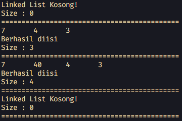

### 1.3 Pertanyaan dan Jawaban :

1. Jelaskan perbedaan antara single linked list dengan double linked lists! <br>
**Jawaban :** <br> ``Perbedaannya adalah Single Linked List hanya memiliki satu pointer yaitu next, Sedangkan Double Linked List memiliki dua pointer yaitu prev dan next.``

2. Perhatikan class Node, di dalamnya terdapat atribut next dan prev. Untuk apakah atribut 
tersebut? <br>
**Jawaban :** <br> ``Untuk menyimpan alamat node sebelumnya dan sesudahnya.``

3. Perhatikan konstruktor pada class DoubleLinkedLists. Apa kegunaan inisialisasi atribut head dan 
size seperti pada gambar berikut ini? <br>
**Jawaban :** <br> ``Kegunaannya adalah untuk menginisialisasi Double Linked List kosong.``

1. Pada method addFirst(), kenapa dalam pembuatan object dari konstruktor class Node prev 
dianggap sama dengan null? <br>
Node newNode = new Node(null, item, head); <br>
**Jawaban :** <br> ``Karena pada node yang paling awal dari Double Linked List tidak memiliki node sebelumnya.``

1. Perhatikan pada method addFirst(). Apakah arti statement head.prev = newNode ? <br>
**Jawaban :** <br> ``Yaitu memasukkan alamat node baru ke dalam node prev dari node head.``

1. Perhatikan isi method addLast(), apa arti dari pembuatan object Node dengan mengisikan 
parameter prev dengan current, dan next dengan null? <br>
Node newNode = new Node(current, item, null); <br>
**Jawaban :** <br> ``Artinya adalah membuat node baru dengan prev menyimpan alamat node terakhir dan next yang bernilai null karena node terakhir tidak memiliki next.``

1. Pada method add(), terdapat potongan kode program sebagai berikut: <br>
   jelaskan maksud dari bagian yang ditandai dengan kotak kuning <br>
**Jawaban :** <br> ``Maksudnya adalah jika yang ditemukan adalah node dengan node prev yang bernilai null (node paling awal), maka akan dibuat node baru yang akan menjadi node paling awal.``

<br><hr>

### **2.0 Percobaan 2**

### 2.1 Kode Percobaan :

``DoubleLinkedList.java`` <br>
```java
// Percobaan 2

public void removeFirst() throws Exception {
    if (isEmpty()) {
        throw new Exception("Linked List masih kosong, tidak dapat dihapus!");
    } else if (size == 1) {
        removeLast();
    } else {
        head = head.next;
        head.prev = null;
        size--;
    }
}

public void removeLast() throws Exception {
    if (isEmpty()) {
        throw new Exception("Linked List masih kosong, tidak dapat dihapus!");
    } else if (head.next == null) {
        head = null;
        size--;
        return;
    }
    Node current = head;

    while (current.next.next != null) {
        current = current.next;
    }

    current.next = null;
    size--;
}

public void remove(int index) throws Exception {
    if (isEmpty() || index >= size) {
        throw new Exception("Nilai indeks di luar batas");
    } else if (index == 0) {
        removeFirst();
    } else {
        Node current = head;
        int i = 0;
        while (i < index) {
            current = current.next;
            i++;
        }

        if (current.next == null) {
            current.prev.next = null;
        } else if (current.prev == null) {
            current = current.next;
            current.prev = null;
            head = current;
        } else {
            current.prev.next = current.next;
            current.next.prev = current.prev;
        }

        size--;
    }
}
```

``DoubleLinkedListMain.java`` <br>
```java
// Percobaan 2

dll.addLast(50);
dll.addLast(40);
dll.addLast(10);
dll.addLast(20);
dll.print();
System.out.println("Size : " + dll.size);
System.out.println("============================================");
try {
    dll.removeFirst();
} catch (Exception e) {
    System.out.println(e);
}
dll.print();
System.out.println("Size : " + dll.size);
System.out.println("============================================");
try {
    dll.removeLast();
} catch (Exception e) {
    System.out.println(e);
}
dll.print();
System.out.println("Size : " + dll.size);
System.out.println("============================================");
try {
    dll.remove(1);
} catch (Exception e) {
    System.out.println(e);
}
dll.print();
System.out.println("Size : " + dll.size);
System.out.println("============================================");
```

### 2.2 Verifikasi Hasil Percobaan :

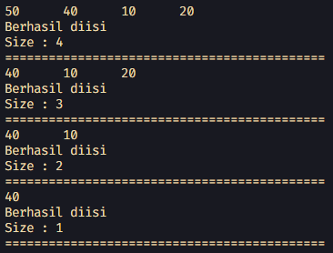

### 2.3 Pertanyaan dan Jawaban :

1. Apakah maksud statement berikut pada method removeFirst()? <br>
head = head.next; <br>
head.prev = null <br>
**Jawaban :** <br> ``Maksudnya adalah menggeser alamat head ke node setelahnya dan menjadikan node prev dari node tersebut menjadi null``

2. Bagaimana cara mendeteksi posisi data ada pada bagian akhir pada method removeLast()? <br>
**Jawaban :** <br> ``Dengan melakukan while loop sampai menemukan node sebelum node terakhir. Kemudian menghapus node next dari node tersebut``

3. Jelaskan alasan potongan kode program di bawah ini tidak cocok untuk perintah remove! <br>
**Jawaban :** <br> ``Alasannya adalah potongan tersebut hanya bisa menghapus node next dari node head. Sedangkan perintah remove dibutuhkan untuk bisa menghapus node di index manapun.``

4. Jelaskan fungsi kode program berikut ini pada fungsi remove! <br>
**Jawaban :** <br> ``Fungsinya adalah untuk mengubah alamat referensi dari node next dari node sebelum node yang ingin dihapus menjadi node setelah node yang ingin dihapus dan mengubah alamat referensi dari node prev dari node setelah node yang ingin dihapus menjadi node sebelum node yang ingin dihapus``

<br><hr>

### **3.0 Percobaan 3**

### 3.1 Kode Percobaan :

``DoubleLinkedList.java`` <br>
```java
// Percobaan 3

public int getFirst() throws Exception {
    if (isEmpty()) {
        throw new Exception("Linked list kosong");
    }

    return head.data;
}

public int getLast() throws Exception {
    if (isEmpty()) {
        throw new Exception("Linked List Kosong!");
    }

    Node tmp = head;
    while (tmp.next != null) {
        tmp = tmp.next;
    }
    return tmp.data;
}

public int get(int index) throws Exception {
    if (isEmpty() || index >= size) {
        throw new Exception("Nilai index di luar batas!");
    }

    Node tmp = head;
    for (int i = 0; i < index; i++) {
        tmp = tmp.next;
    }
    return tmp.data;
}
```

``DoubleLinkedListMain.java`` <br>
```java
// Percobaan 3

dll.print();
System.out.println("Size : " + dll.size);
System.out.println("============================================");
dll.addFirst(3);
dll.addFirst(4);
dll.addFirst(7);
dll.print();
System.out.println("Size : " + dll.size);
System.out.println("============================================");
try {
    dll.add(40, 1);
} catch (Exception e) {
    System.out.println(e);
}
dll.print();
System.out.println("Size : " + dll.size);
System.out.println("============================================");
try {
    System.out.println("Data awal pada Linked Lists adalah : " + dll.getFirst());
    System.out.println("Data akhir pada Linked Lists adalah : " + dll.getLast());
    System.out.println("Data indeks ke-1 pada Linked Lists adalah : " + dll.get(1));
} catch (Exception e) {
    System.out.println(e);
}
System.out.println("============================================");
```

### 3.2 Verifikasi Hasil Percobaan :

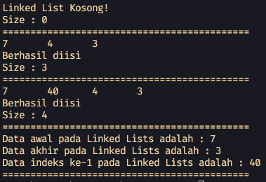

### 3.3 Pertanyaan dan Jawaban :

1. Jelaskan method size() pada class DoubleLinkedLists! <br>
**Jawaban :** <br> ``Method tersebut mengembalikan integer size atau jumlah node yang ada di dalam Double Linked List``

2. Jelaskan cara mengatur indeks pada double linked lists supaya dapat dimulai dari indeks ke-1! <br>
**Jawaban :** <br> ``Caranya adalah dengan mengubah seluruh variable i yang digunakan untuk perulangan menjadi 1 ``

3. Jelaskan perbedaan karakteristik fungsi Add pada Double Linked Lists dan Single Linked Lists! <br>
**Jawaban :** <br> ``Perbedaanya adalah Single Linked List menambahkan node baru pada setelah node yang didapat dari pencarian index, sedangkan Double Linked List menambahkan node baru sebelum node yang didapat dari pencarian index``

4. Jelaskan perbedaan logika dari kedua kode program di bawah ini! <br>
**Jawaban :** <br> ``Perbedaannya adalah kode a memeriksa variable size untuk mendapatkan kembalian boolean, sedangkan kode b menggunakan variable head untuk mendapatkan kembalian boolean``

<br><hr>

## TUGAS

### **4.1.0 Tugas 1 : Studi Kasus Vaksin**

### 4.1.1 Kode Program : 

``Node.java`` <br>
```java
public class Node {
    int nomor;
    String nama;
    Node prev, next;

    Node(Node prev, int nomor, String nama, Node next) {
        this.nomor = nomor;
        this.nama = nama;
        this.prev = prev;
        this.next = next;
    }
}
```

``VaksinDLL.java`` <br>
```java
public class VaksinDLL {
    Node head;
    int size;

    public VaksinDLL() {
        head = null;
        size = 0;
    }

    public boolean isEmpty() {
        return head == null;
    }

    public int size() {
        return size;
    }

    public void clear() {
        head = null;
        size = 0;
    }

    public void print() {
        if (!isEmpty()) {
            Node current = head;

            System.out.printf("| %-5s | %-10s |\n", "No.", "Nama");

            while (current != null) {
                System.out.printf("| %-5d | %-10s |\n", current.nomor, current.nama);
                current = current.next;
            }
            System.out.println("Sisa antrian : " + size());
        } else {
            System.out.println("Antrian Kosong!");
        }
    }

    public void enQueue(int nomor, String nama) {
        if (isEmpty()) {
            head = new Node(null, nomor, nama, null);
        } else {
            Node newNode = new Node(null, nomor, nama, head);
            head.prev = newNode;
            head = newNode;
        }

        size++;
    }

    public Node deQueue() throws Exception {
        Node temp = head;

        if (isEmpty()) {
            throw new Exception("Antrian masih kosong, tidak dapat melayani!");
        } else if (size == 1) {
            head = null;
            size--;
        } else {
            head = head.next;
            head.prev = null;
            size--;
        }

        return temp;
    }
}
```

``VaksinDLLMain.java`` <br>
```java
import java.util.Scanner;

public class VaksinDLLMain {

    public static void main(String[] args) {

        Scanner sc = new Scanner(System.in);
        VaksinDLL DLLVaksin = new VaksinDLL();
        int pilihan = -1;

        do {
            System.out.println("+++++++++++++++++++++++++++++");
            System.out.println("PENGANTRI VAKSIN EXTRAVAGANZA");
            System.out.println("+++++++++++++++++++++++++++++");
            System.out.println("[1] Tambah ke antrian");
            System.out.println("[2] Layani pengantri vaksin");
            System.out.println("[3] Daftar penerima vaksin");
            System.out.println("[4] Keluar");
            System.out.println("+++++++++++++++++++++++++++++");
            System.out.print("> Pilih menu : ");
            pilihan = sc.nextInt();
            sc.nextLine();

            switch (pilihan) {
                case 1:
                    System.out.println("-----------------------------");
                    System.out.println("Masukkan Data Penerima Vaksin");
                    System.out.println("-----------------------------");
                    System.out.print("> Nomor antrian : ");
                    int nomor = sc.nextInt();
                    sc.nextLine();
                    System.out.print("> Nama penerima : ");
                    String nama = sc.nextLine();
                    DLLVaksin.enQueue(nomor, nama);
                    break;

                case 2:
                    try {

                        System.out.println("-----------------------------");
                        System.out.println(DLLVaksin.deQueue().nama + " telah selesai divaksinasi.");
                        System.out.println("-----------------------------");
                    } catch (Exception e) {
                        e.printStackTrace();
                    }
                    break;

                case 3:
                    System.out.println("+++++++++++++++++++++++");
                    System.out.println("Daftar Pengantri Vaksin");
                    System.out.println("+++++++++++++++++++++++");
                    DLLVaksin.print();
                    break;

                case 4:
                    System.out.println("Goodbye :)");
                    break;

                default:
                    System.out.println("Pilihan tidak tersedia!");
                    break;
            }

        } while (pilihan != 4);

        sc.close();
    }
}
```

### 4.1.2 Verifikasi Hasil Program :

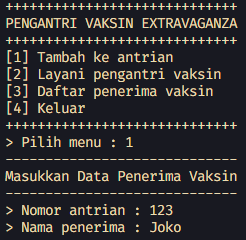

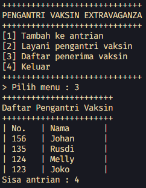

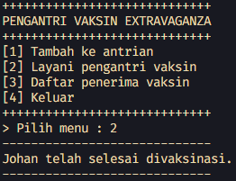

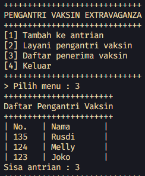

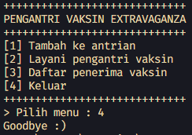

<br><hr>

### **4.2.0 Tugas 2 : Studi Kasus Film**

### 4.2.1 Kode Program : 

``Node.java`` <br>
```java
public class Node {
    Node prev, next;
    int id;
    String judul;
    double rating;

    Node(Node prev, int id, String judul, double rating, Node next) {
        this.prev = prev;
        this.id = id;
        this.judul = judul;
        this.rating = rating;
        this.next = next;
    }
}
```

``FilmDLL.java`` <br>
```java
public class FilmDLL {
    Node head;
    int size;

    public FilmDLL() {
        head = null;
        size = 0;
    }

    public boolean isEmpty() {
        return head == null;
    }

    public int size() {
        return size;
    }

    public void addFirst(int id, String nama, double rating) {
        if (isEmpty()) {
            head = new Node(null, id, nama, rating, null);
        } else {
            Node newNode = new Node(null, id, nama, rating, head);
            head.prev = newNode;
            head = newNode;
        }

        size++;
    }

    public void addLast(int id, String nama, double rating) {
        if (isEmpty()) {
            addFirst(id, nama, rating);
        } else {
            Node current = head;

            while (current.next != null) {
                current = current.next;
            }

            Node newNode = new Node(current, id, nama, rating, null);
            current.next = newNode;
            size++;
        }
    }

    public void addAtIndex(int id, String nama, double rating, int index) throws Exception {
        if (isEmpty()) {
            addFirst(id, nama, rating);
        } else if (index < 0 || index > size) {
            throw new Exception("Nilai indeks di luar batas!");
        } else {
            Node current = head;
            int i = 0;

            while (i < index) {
                current = current.next;
                i++;
            }

            if (current.prev == null) {
                Node newNode = new Node(null, id, nama, rating, current);
                current.prev = newNode;
                head = newNode;
            } else {
                Node newNode = new Node(current.prev, id, nama, rating, current);
                newNode.prev = current.prev;
                newNode.next = current;
                current.prev.next = newNode;
                current.prev = newNode;
            }
        }

        size++;
    }

    public void clear() {
        head = null;
        size = 0;
    }

    public void print() {
        if (!isEmpty()) {
            Node current = head;

            while (current != null) {
                System.out.println("ID : " + current.id);
                System.out.println(" Judul : " + current.judul);
                System.out.println(" Rating : " + current.rating);
                current = current.next;
            }
        } else {
            System.out.println("Linked List Kosong!");
        }
    }

    public void removeFirst() throws Exception {
        if (isEmpty()) {
            throw new Exception("Linked List masih kosong, tidak dapat dihapus!");
        } else if (size == 1) {
            removeLast();
        } else {
            head = head.next;
            head.prev = null;
            size--;
        }
    }

    public void removeLast() throws Exception {
        if (isEmpty()) {
            throw new Exception("Linked List masih kosong, tidak dapat dihapus!");
        } else if (head.next == null) {
            head = null;
            size--;
            return;
        }
        Node current = head;

        while (current.next.next != null) {
            current = current.next;
        }

        current.next = null;
        size--;
    }

    public void removeAtIndex(int index) throws Exception {
        if (isEmpty() || index >= size) {
            throw new Exception("Nilai indeks di luar batas");
        } else if (index == 0) {
            removeFirst();
        } else {
            Node current = head;
            int i = 0;
            while (i < index) {
                current = current.next;
                i++;
            }

            if (current.next == null) {
                current.prev.next = null;
            } else if (current.prev == null) {
                current = current.next;
                current.prev = null;
                head = current;
            } else {
                current.prev.next = current.next;
                current.next.prev = current.prev;
            }

            size--;
        }
    }

    public Node getFilmById(int key) {
        Node current = head;

        while (current != null) {
            if (current.id == key) {
                return current;
            }
            current = current.next;
        }

        return null;
    }

    public int getFilmIndexById(int key) {
        Node current = head;

        for (int i = 0; current != null; i++) {
            if (current.id == key) {
                return i;
            }
            current = current.next;
        }
        return -1;
    }

    public void sortFilmDesc() throws Exception {
        Node current, previous;
        boolean sorted;

        if (isEmpty()) {
            throw new Exception("Linked List masih kosong, tidak dapat disortir!");
        } else {
            do {
                sorted = true;
                current = head;
                previous = null;

                while (current.next != null) {
                    if (current.rating < current.next.rating) {
                        Node temp = current.next;

                        if (previous == null) {
                            head = temp;
                        } else {
                            previous.next = temp;
                        }
                        current.next = temp.next;
                        temp.next = current;

                        sorted = false;
                        previous = temp;

                    } else {
                        previous = current;
                        current = current.next;
                    }
                }
            } while (!sorted);
        }
    }
}
```

``FilmDLLMain.java`` <br>
```java
import java.util.Scanner;

public class FilmDLLMain {

    public static void main(String[] args) {

        Scanner sc = new Scanner(System.in);
        FilmDLL filmDLL = new FilmDLL();
        int pilihan = -1;
        int id, index;
        String judul;
        double rating;

        do {
            System.out.println("=====================================");
            System.out.println("DATA FILM LAYAR LEBAR");
            System.out.println("=====================================");
            System.out.println("[1] Tambah data awal");
            System.out.println("[2] Tambah data akhir");
            System.out.println("[3] Tambah data index tertentu");
            System.out.println("[4] Hapus data pertama");
            System.out.println("[5] Hapus data terakhir");
            System.out.println("[6] Hapus data tertentu");
            System.out.println("[7] Cetak");
            System.out.println("[8] Cari ID film");
            System.out.println("[9] Urut data rating film - Desc");
            System.out.println("[10] Keluar");
            System.out.println("=====================================");
            System.out.print("Pilih menu : ");
            pilihan = sc.nextInt();
            sc.nextLine();

            switch (pilihan) {
                case 1:
                    System.out.println("Masukkan Data Film Pada Posisi Awal");
                    System.out.print("ID Film : ");
                    id = sc.nextInt();
                    sc.nextLine();
                    System.out.print("Judul Film : ");
                    judul = sc.nextLine();
                    System.out.print("Rating Film : ");
                    rating = sc.nextDouble();
                    sc.nextLine();
                    filmDLL.addFirst(id, judul, rating);
                    break;

                case 2:
                    System.out.println("Masukkan Data Film Pada Posisi Akhir");
                    System.out.print("ID Film : ");
                    id = sc.nextInt();
                    sc.nextLine();
                    System.out.print("Judul Film : ");
                    judul = sc.nextLine();
                    System.out.print("Rating Film : ");
                    rating = sc.nextDouble();
                    sc.nextLine();
                    filmDLL.addLast(id, judul, rating);
                    break;

                case 3:
                    System.out.println("Masukkan Data Film Pada Posisi Tertentu");
                    System.out.print("ID Film : ");
                    id = sc.nextInt();
                    sc.nextLine();
                    System.out.print("Judul Film : ");
                    judul = sc.nextLine();
                    System.out.print("Rating Film : ");
                    rating = sc.nextDouble();
                    sc.nextLine();
                    System.out.print("Data film ini akan masuk di urutan ke- : ");
                    index = sc.nextInt();
                    sc.nextLine();
                    try {
                        filmDLL.addAtIndex(id, judul, rating, index);
                    } catch (Exception e) {
                        e.printStackTrace();
                    }
                    break;

                case 4:
                    System.out.println("Menghapus Data Film Pada Posisi Awal");
                    try {
                        filmDLL.removeFirst();
                    } catch (Exception e) {
                        e.printStackTrace();
                    }
                    break;

                case 5:
                    System.out.println("Menghapus Data Film Pada Posisi Akhir");
                    try {
                        filmDLL.removeLast();
                    } catch (Exception e) {
                        System.out.println(e);
                    }
                    break;

                case 6:
                    System.out.println("Menghapus Data Film Pada Posisi Tertentu");
                    System.out.print("Masukkan index data film untuk dihapus : ");
                    index = sc.nextInt();
                    sc.nextLine();
                    try {
                        filmDLL.removeAtIndex(index);
                    } catch (Exception e) {
                        System.out.println(e);
                    }
                    break;

                case 7:
                    System.out.println("Cetak data :");
                    filmDLL.print();
                    break;

                case 8:
                    System.out.println("Cari data");
                    System.out.print("Masukkan ID film yang dicari : ");
                    int key = sc.nextInt();
                    sc.nextLine();
                    Node found = filmDLL.getFilmById(key);
                    if (found != null) {
                        System.out.println(
                                "Data ID Film : " + found.id + " berada di node ke-" + filmDLL.getFilmIndexById(key));
                        System.out.println("IDENTITAS : ");
                        System.out.println("ID Film     : " + found.id);
                        System.out.println("Judul Film  : " + found.judul);
                        System.out.println("Rating Film : " + found.rating);
                    } else {
                        System.out.println("Data Film Tidak Ditemukan!");
                    }
                    break;

                case 9:
                    System.out.println("Sortir Film Berdasarkan Rating DESC");
                    try {
                        filmDLL.sortFilmDesc();
                    } catch (Exception e) {
                        System.out.println(e);
                    }
                    filmDLL.print();
                    break;

                case 10:
                    System.out.println("Goodbye :)");
                    break;

                default:
                    System.out.println("Pilihan tidak ditemukan!");
                    break;
            }
        } while (pilihan != 10);

        sc.close();
    }
}
```

### 4.2.2 Verifikasi Hasil Program : 

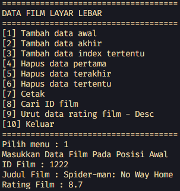

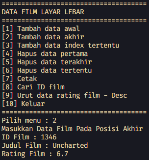

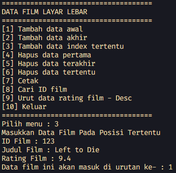

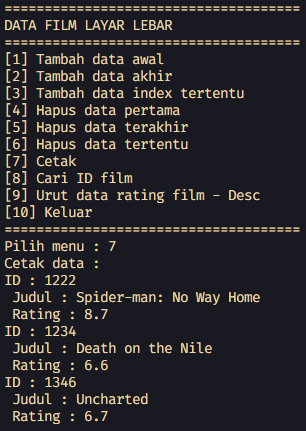

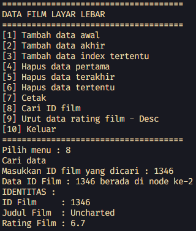

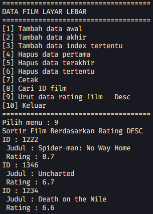