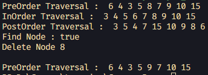
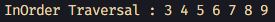
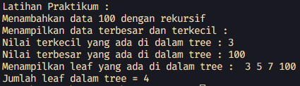
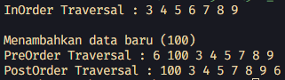

# <p align="center">LAPORAN JOBSHEET XIII - TREE</p>

### **IDENTITAS MAHASISWA**
**Nama :** Haikal Muhammad Rafli<br>
**NIM :** 2341720008<br>
**Kelas :** TI-1B<br>
**Absen :** 14

## PRAKTIKUM

### **1.0 Percobaan 1**

### 1.1 Kode Percobaan : 

``Node14.java`` <br>
```java
public class Node14 {

    int data;
    Node14 left;
    Node14 right;

    public Node14() {
    }

    public Node14(int data) {
        this.left = null;
        this.data = data;
        this.right = null;
    }
}
```

``BinaryTree14.java`` <br>
```java
public class BinaryTree14 {

    Node14 root;

    public BinaryTree14() {
        root = null;
    }

    boolean isEmpty() {
        return root == null;
    }

    void add(int data) {
        if (isEmpty()) {
            root = new Node14(data);
        } else {
            Node14 current = root;
            while (true) {
                if (data < current.data) {
                    if (current.left != null) {
                        current = current.left;
                    } else {
                        current.left = new Node14(data);
                        break;
                    }
                } else if (data > current.data) {
                    if (current.right != null) {
                        current = current.right;
                    } else {
                        current.right = new Node14(data);
                        break;
                    }
                } else {
                    break;
                }
            }
        }
    }

    boolean find(int data) {
        boolean result = false;
        Node14 current = root;

        while (current != null) {
            if (current.data == data) {
                result = true;
                break;
            } else if (data < current.data) {
                current = current.left;
            } else {
                current = current.right;
            }
        }

        return result;
    }

    void traversePreOrder(Node14 node) {
        if (node != null) {
            System.out.print(" " + node.data);
            traversePreOrder(node.left);
            traversePreOrder(node.right);
        }
    }

    void traversePostOrder(Node14 node) {
        if (node != null) {
            traversePostOrder(node.left);
            traversePostOrder(node.right);
            System.out.print(" " + node.data);
        }
    }

    void traverseInOrder(Node14 node) {
        if (node != null) {
            traverseInOrder(node.left);
            System.out.print(" " + node.data);
            traverseInOrder(node.right);
        }
    }

    Node14 getSuccessor(Node14 del) {
        Node14 successor = del.right;
        Node14 successorParent = del;

        while (successor.left != null) {
            successorParent = successor;
            successor = successor.left;
        }

        if (successor != del.right) {
            successorParent.left = successor.right;
            successor.right = del.right;
        }

        return successor;
    }

    void delete(int data) {
        if (isEmpty()) {
            System.out.println("Tree is empty!");
            return;
        }

        Node14 parent = root;
        Node14 current = root;
        boolean isLeftChild = false;

        while (current != null) {
            if (current.data == data) {
                break;
            } else if (data < current.data) {
                parent = current;
                current = current.left;
                isLeftChild = true;
            } else if (data > current.data) {
                parent = current;
                current = current.right;
                isLeftChild = false;
            }
        }

        if (current == null) {
            System.out.println("Couldn't find data!");
            return;
        } else {
            if (current.left == null && current.right == null) {
                if (current == root) {
                    root = null;
                } else {
                    if (isLeftChild) {
                        parent.left = null;
                    } else {
                        parent.right = null;
                    }
                }
            } else if (current.left == null) {
                if (current == root) {
                    root = current.right;
                } else {
                    if (isLeftChild) {
                        parent.left = current.right;
                    } else {
                        parent.right = current.right;
                    }
                }
            } else if (current.right == null) {
                if (current == root) {
                    root = current.left;
                } else {
                    if (isLeftChild) {
                        parent.left = current.left;
                    } else {
                        parent.right = current.left;
                    }
                }
            } else {
                Node14 successor = getSuccessor(current);
                if (isLeftChild) {
                    parent.left = successor;
                } else {
                    parent.right = successor;
                }
                successor.left = current.left;
            }
        }
    }
}
```

``BinaryTreeMain14.java`` <br>
```java
public class BinaryTreeMain14 {

    public static void main(String[] args) {

        BinaryTree14 bt = new BinaryTree14();
        bt.add(6);
        bt.add(4);
        bt.add(8);
        bt.add(3);
        bt.add(5);
        bt.add(7);
        bt.add(9);
        bt.add(10);
        bt.add(15);
        System.out.print("PreOrder Traversal : ");
        bt.traversePreOrder(bt.root);
        System.out.println("");
        System.out.print("InOrder Traversal : ");
        bt.traverseInOrder(bt.root);
        System.out.println("");
        System.out.print("PostOrder Traversal : ");
        bt.traversePostOrder(bt.root);
        System.out.println("");
        System.out.println("Find Node : " + bt.find(5));
        System.out.println("Delete Node 8 ");
        bt.delete(8);
        System.out.println("");
        System.out.print("PreOrder Traversal : ");
        bt.traversePreOrder(bt.root);
        System.out.println("");
    }
}
```

### 1.2 Verifikasi Hasil Percobaan :



### 1.3 Pertanyaan dan Jawaban :

1. Mengapa dalam binary search tree proses pencarian data bisa lebih efektif dilakukan dibanding binary tree biasa? <br>
**Jawaban :** <br> ``Karena peletakan data dilakukan dengan urut dari yang terkecil (paling kiri) sampai yang terbesar (paling kanan)``

2. Untuk apakah di class Node, kegunaan dari atribut left dan right? <br>
**Jawaban :** <br> ``Sebagai pointer ke node child kiri atau child kanan``

3. Untuk apakah kegunaan dari atribut root di dalam class BinaryTree? dan Ketika objek tree pertama kali dibuat, apakah nilai dari root? <br>
**Jawaban :** <br> ``Kegunaannya adalah untuk menyimpan pointer node akar / node yang tidak memiliki predesesor. nilai dari root saat pertama kali dibuatnya objek tree adalah null``

4. Ketika tree masih kosong, dan akan ditambahkan sebuah node baru, proses apa yang akan terjadi? <br>
**Jawaban :** <br> ``Mengecek apakah tree dalam kondisi kosong atau tidak. Jika kosong maka akan membuat node baru dan disimpan di dalam root. Sedangkan jika tidak kosong maka akan diletakkan sesuai nilai data yang diinputkan``

5. Perhatikan method add(), di dalamnya terdapat baris program seperti di bawah ini. Jelaskan secara detail untuk apa baris program tersebut?

    ```java
    if(data < current.data){
        if(current.left != null){
            current = current.left;
        }else{
            current.left = new Node(data);
        break;
        }
    }
    ``` 
    **Jawaban :** <br> ``Baris diatas itu digunakan untuk mengecek apakah nilai data input itu lebih kecil dari pada data dari node current. Jika benar maka dilakukan pengecekan lagi apakah node  left dari node current itu tidak bernilai null. Jika benar maka akan melakukan traverse ke kiri sekali. Jika tidak benar maka akan menambahkan node baru di node kiri dari node current``

<br><hr>

### **2.0 Percobaan 2**

### 2.1 Kode Percobaan : 

``BinaryTreeArray14.java`` <br>
```java
public class BinaryTreeArray14 {

    int[] data;
    int idxLast;

    public BinaryTreeArray14() {
        data = new int[10];
    }

    void populateData(int data[], int idxLast) {
        this.data = data;
        this.idxLast = idxLast;
    }

    void traverseInOrder(int idxStart) {
        if (idxStart <= idxLast) {
            traverseInOrder(2 * idxStart + 1);
            System.out.print(data[idxStart] + " ");
            traverseInOrder(2 * idxStart + 2);
        }
    }
}
```

``BinaryTreeArrayMain14.java`` <br>
```java
public class BinaryTreeArrayMain14 {

    public static void main(String[] args) {

        BinaryTreeArray14 bta = new BinaryTreeArray14();
        int data[] = { 6, 4, 8, 3, 5, 7, 9, 0, 0, 0 };
        int idxLast = 6;

        bta.populateData(data, idxLast);
        System.out.print("\nInOrder Traversal : ");
        bta.traverseInOrder(0);
        System.out.println("\n");
    }
}
```

### 2.2 Verifikasi Hasil Percobaan : 



### 2.3 Pertanyaan dan Jawaban : 

1. Apakah kegunaan dari atribut data dan idxLast yang ada di class BinaryTreeArray? <br>
**Jawaban :** <br> ``Kegunaan dari atribut data adalah untuk menyimpan elemen-elemen dari binary tree. Sedangkan kegunaan dari atribut idxLast adalah untuk menyimpan indeks dari elemen yang terakhir dimasukkan ke dalam tree``

2. Apakah kegunaan dari method populateData()? <br>
**Jawaban :** <br> ``Kegunaannya adalah untuk menyimpan input elemen-elemen data[] dan index idxLast di dalam object tree array yang sudah dibuat``

3. Apakah kegunaan dari method traverseInOrder()? <br>
**Jawaban :** <br> ``Kegunaannya adalah untuk melakukan traverse dan menampilkan data secara in order.``

4. Jika suatu node binary tree disimpan dalam array indeks 2, maka di indeks berapakah posisi left child dan right child masing-masing? <br>
**Jawaban :** <br> ``Left child berada dalam posisi indeks ke (2 * 2 + 1 = 5) 5 dan right childnya berada dalam posisi indeks ke (2 * 2 + 2 = 6) 6``

5. Apa kegunaan statement int idxLast = 6 pada praktikum 2 percobaan nomor 4? <br>
**Jawaban :** <br> ``Kegunaannya adalah untuk menyimpan suatu integer di dalam variable idxLast yang digunakan untuk menyimpan indeks elemen terakhir dalam tree``

<br><hr>

## TUGAS PRAKTIKUM

### **4.1.0 Soal 1**

### 4.1.1 Kode Percobaan : 

``BinaryTree14.java`` <br>
```java
void addRecursively(int data) {
    root = addRecursively(root, data);
}

Node14 addRecursively(Node14 current, int data) {
    if (current == null) {
        return root = new Node14(data);
    }

    if (data < current.data) {
        current.left = addRecursively(current.left, data);
    } else if (data > current.data) {
        current.right = addRecursively(current.right, data);
    }

    return current;
}
```

<br><hr>

### **4.2.0 Soal 2**

### 4.2.1 Kode Percobaan : 

``BinaryTree14.java`` <br>
```java
void findMaxMin() {
    int min = findMin();
    int max = findMax();

    System.out.println("Nilai terkecil yang ada di dalam tree : " + min);
    System.out.println("Nilai terbesar yang ada di dalam tree : " + max);
}

int findMin() {
    Node14 current = root;

    while (current.left != null) {
        current = current.left;
    }

    return current.data;
}

int findMax() {
    Node14 current = root;

    while (current.right != null) {
        current = current.right;
    }

    return current.data;
}
```

<br><hr>

### **4.3.0 Soal 3**

### 4.3.1 Kode Percobaan : 

``BinaryTree14.java`` <br>
```java
void printLeaves(Node14 node) {
    if (node != null) {
        if (node.left == null && node.right == null) {
            System.out.print(" " + node.data);
        }

        printLeaves(node.left);
        printLeaves(node.right);
    }
}
```

<br><hr>

### **4.4.0 Soal 4**

### 4.4.1 Kode Percobaan : 

``BinaryTree14.java`` <br>
```java
int countLeaves(Node14 node) {
    if (node == null) {
        return 0;
    }

    if (node.left == null && node.right == null) {
        return 1;
    }

    return countLeaves(node.left) + countLeaves(node.right);
}

void countLeaves() {
    System.out.println("Jumlah leaf dalam tree = " + countLeaves(root));
}
```

<br><hr>

### **4.5.0 Soal 5**

### 4.5.1 Kode Percobaan : 

``BinaryTreeArray14.java`` <br>
```java
void add(int data) {
    this.data[++idxLast] = data;
}

void traversePreOrder(int idxStart) {
    if (idxStart <= idxLast) {
        System.out.print(data[idxStart] + " ");
        traverseInOrder(2 * idxStart + 1);
        traverseInOrder(2 * idxStart + 2);
    }
}

void traversePostOrder(int idxStart) {
    if (idxStart <= idxLast) {
        traverseInOrder(2 * idxStart + 1);
        traverseInOrder(2 * idxStart + 2);
        System.out.print(data[idxStart] + " ");
    }
}
```

### **4.0.0 Verifikasi Hasil Kode Program**



