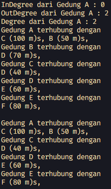
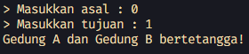
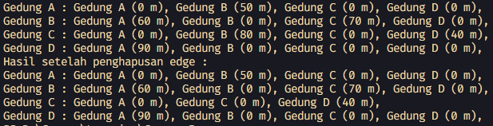
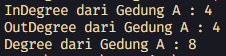
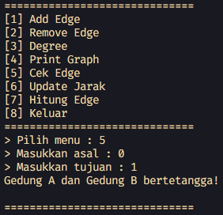
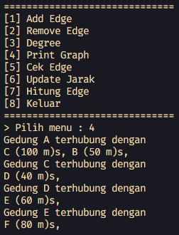
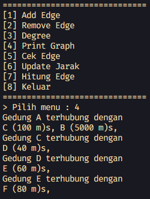
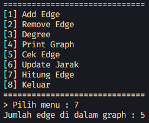

# <p align="center">LAPORAN JOBSHEET XII - GRAPH</p>

### **IDENTITAS MAHASISWA**
**Nama :** Haikal Muhammad Rafli<br>
**NIM :** 2341720008<br>
**Kelas :** TI-1B<br>
**Absen :** 14

## PRAKTIKUM

### **1.0 Percobaan 1**

### 1.1 Kode Percobaan : 

``Node14.java`` <br>
```java
package percobaan_1;

public class Node14 {

    int data;
    Node14 prev, next;
    int jarak;

    Node14(Node14 prev, int data, int jarak, Node14 next) {
        this.prev = prev;
        this.data = data;
        this.next = next;
        this.jarak = jarak;
    }
}
```

``DoubleLinkedList14.java`` <br>
```java
package percobaan_1;

public class DoubleLinkedList14 {
    Node14 head;
    int size;

    public DoubleLinkedList14() {
        head = null;
        size = 0;
    }

    public boolean isEmpty() {
        return head == null;
    }

    public int size() {
        return size;
    }

    public void addFirst(int item, int jarak) {
        if (isEmpty()) {
            head = new Node14(null, item, jarak, null);
        } else {
            Node14 newNode = new Node14(null, item, jarak, head);
            head.prev = newNode;
            head = newNode;
        }

        size++;
    }

    public void addLast(int item, int jarak) {
        if (isEmpty()) {
            addFirst(item, jarak);
        } else {
            Node14 current = head;

            while (current.next != null) {
                current = current.next;
            }

            Node14 newNode = new Node14(current, item, jarak, null);
            current.next = newNode;
            size++;
        }
    }

    public void add(int item, int jarak, int index) throws Exception {
        if (isEmpty()) {
            addFirst(item, jarak);
        } else if (index < 0 || index > size) {
            throw new Exception("Nilai indeks di luar batas!");
        } else {
            Node14 current = head;
            int i = 0;

            while (i < index) {
                current = current.next;
                i++;
            }

            if (current.prev == null) {
                Node14 newNode = new Node14(null, item, jarak, current);
                current.prev = newNode;
                head = newNode;
            } else {
                Node14 newNode = new Node14(current.prev, item, jarak, current);
                newNode.prev = current.prev;
                newNode.next = current;
                current.prev.next = newNode;
                current.prev = newNode;
            }
        }

        size++;
    }

    public void clear() {
        head = null;
        size = 0;
    }

    public void print() {
        if (!isEmpty()) {
            Node14 tmp = head;

            while (tmp != null) {
                System.out.print(tmp.data + "\t");
                tmp = tmp.next;
            }
            System.out.println("\nBerhasil diisi");
        } else {
            System.out.println("Linked List Kosong!");
        }
    }

    public void removeFirst() throws Exception {
        if (isEmpty()) {
            throw new Exception("Linked List masih kosong, tidak dapat dihapus!");
        } else if (size == 1) {
            removeLast();
        } else {
            head = head.next;
            head.prev = null;
            size--;
        }
    }

    public void removeLast() throws Exception {
        if (isEmpty()) {
            throw new Exception("Linked List masih kosong, tidak dapat dihapus!");
        } else if (head.next == null) {
            head = null;
            size--;
            return;
        }
        Node14 current = head;

        while (current.next.next != null) {
            current = current.next;
        }

        current.next = null;
        size--;
    }

    public void remove(int index) {
        Node14 current = head;

        while (current != null) {
            if (current.data == index) {
                if (current.prev != null) {
                    current.prev.next = current.next;
                } else {
                    head = current.next;
                }

                if (current.next != null) {
                    current.next.prev = current.prev;
                }
                break;
            }
            current = current.next;
        }
        size--;
    }

    public int getFirst() throws Exception {
        if (isEmpty()) {
            throw new Exception("Linked list kosong");
        }

        return head.data;
    }

    public int getLast() throws Exception {
        if (isEmpty()) {
            throw new Exception("Linked List Kosong!");
        }

        Node14 tmp = head;
        while (tmp.next != null) {
            tmp = tmp.next;
        }
        return tmp.data;
    }

    public int get(int index) throws Exception {
        if (isEmpty() || index >= size) {
            throw new Exception("Nilai index di luar batas!");
        }

        Node14 tmp = head;
        for (int i = 0; i < index; i++) {
            tmp = tmp.next;
        }
        return tmp.data;
    }

    public int getJarak(int index) throws Exception {
        if (isEmpty() || index >= size) {
            throw new Exception("Nilai indeks diluar batas");
        }

        Node14 tmp = head;
        for (int i = 0; i < index; i++) {
            tmp = tmp.next;
        }

        return tmp.jarak;
    }
}
```

``Graph14.java`` <br>
```java
package percobaan_1;

public class Graph14 {

    int vertex;
    DoubleLinkedList14 list[];

    public Graph14(int v) {
        vertex = v;
        list = new DoubleLinkedList14[v];

        for (int i = 0; i < v; i++) {
            list[i] = new DoubleLinkedList14();
        }
    }

    public void addEdge(int asal, int tujuan, int jarak) {
        list[asal].addFirst(tujuan, jarak);
        // list[tujuan].addFirst(asal, jarak);
    }

    public void degree(int asal) throws Exception {
        int k, totalIn = 0, totalOut = 0;

        for (int i = 0; i < vertex; i++) {
            // inDegree
            for (int j = 0; j < list[i].size; j++) {
                if (list[i].get(j) == asal) {
                    ++totalIn;
                }
            }

            // outDegree
            for (k = 0; k < list[asal].size; k++) {
                list[asal].get(k);
            }
            totalOut = k;
        }

        System.out.println("InDegree dari Gedung " + (char) ('A' + asal) + " : " + totalIn);
        System.out.println("OutDegree dari Gedung " + (char) ('A' + asal) + " : " + totalOut);
        System.out.println("Degree dari Gedung " + (char) ('A' + asal) + " : " + (totalIn + totalOut));
        // System.out.println("Degree dari Gedung " + (char) ('A' + asal) + " : " +
        // list[asal].size());
    }

    public void removeEdge(int asal, int tujuan) {
        for (int i = 0; i < vertex; i++) {
            if (i == tujuan) {
                list[asal].remove(tujuan);
            }
        }
    }

    public void removeAllEdges() {
        for (int i = 0; i < vertex; i++) {
            list[i].clear();
        }

        System.out.println("Graph berhasil dikosongkan!");
    }

    public void printGraph() throws Exception {
        for (int i = 0; i < vertex; i++) {
            if (list[i].size() > 0) {
                System.out.println("Gedung " + (char) ('A' + i) + " terhubung dengan ");
                for (int j = 0; j < list[i].size(); j++) {
                    System.out.print((char) ('A' + list[i].get(j)) + " (" + list[i].getJarak(j) + " m)s, ");
                }
                System.out.println("");
            }
        }
        System.out.println("");
    }

    public void checkEdge(int asal, int tujuan) throws Exception {
        for (int i = 0; i < list[asal].size(); i++) {
            if (list[asal].get(i) == tujuan) {
                System.out.println(
                        "Gedung " + (char) ('A' + asal) + " dan Gedung " + (char) ('A' + tujuan) + " bertetangga!");
                return;
            }
        }

        System.out.println(
                "Gedung " + (char) ('A' + asal) + " dan Gedung " + (char) ('A' + tujuan) + " tidak bertetangga!");
    }
}
```

``GraphMain14.java`` <br>
```java
package percobaan_1;

public class GraphMain14 {

    public static void main(String[] args) {

        Graph14 gedung = new Graph14(6);
        Scanner sc = new Scanner(System.in);
        int pilihan, asal, tujuan, jarak;

        gedung.addEdge(0, 1, 50);
        gedung.addEdge(0, 2, 100);
        gedung.addEdge(1, 3, 70);
        gedung.addEdge(2, 3, 40);
        gedung.addEdge(3, 4, 60);
        gedung.addEdge(4, 5, 80);

        try {
            gedung.degree(0);
            gedung.printGraph();
            gedung.removeEdge(1, 3);
            gedung.printGraph();

        } catch (Exception e) {
            System.out.println(e);
        }
    }
}
```

### 1.2 Verifikasi Hasil Percobaan :



### 1.3 Pertanyaan dan Jawaban :

1. Perbaiki kode program Anda apabila terdapat error atau hasil kompilasi kode tidak sesuai! <br>
**Jawaban :** <br> ``Menambahkan size-- pada method remove di class DoubleLinkedList14.``
    ```java
    public void remove(int index) {
        Node14 current = head;

        while (current != null) {
            if (current.data == index) {
                if (current.prev != null) {
                    current.prev.next = current.next;
                } else {
                    head = current.next;
                }

                if (current.next != null) {
                    current.next.prev = current.prev;
                }
                // Menambahkan line kode decrement ini
                size--;
                break;
            }
            current = current.next;
        }
    }
    ```

2. Pada class Graph, terdapat atribut list[] bertipe DoubleLinkedList. Sebutkan tujuan pembuatan variabel tersebut! <br>
**Jawaban :** <br> ``Tujuannya adalah untuk menyimpan vertex dan adjency list dari setiap vertex di dalam graph``

3. Jelaskan alur kerja dari method removeEdge! <br>
**Jawaban :** <br> ``Alurnya adalah menelusuri array dengan index yang sama dengan asal. kemudian melakukan metode searching dengan key berupa tujuan untuk mencari dan menghapus node``

4. Apakah alasan pemanggilan method addFirst() untuk menambahkan data, bukan method add jenis lain saat digunakan pada method addEdge pada class Graph? <br>
**Jawaban :** <br> ``Alasannya adalah karena metode addFirst() merupakan metode penambahan data yang paling sederhana dan cepat. Karena metode tersebut tidak memerlukan untuk melakukan traverse``

5. Modifikasi kode program sehingga dapat dilakukan pengecekan apakah terdapat jalur antara suatu node dengan node lainnya, seperti contoh berikut (Anda dapat memanfaatkan Scanner). <br>
**Jawaban :** <br>

    ```java
    public void checkEdge(int asal, int tujuan) throws Exception {
        for (int i = 0; i < list[asal].size(); i++) {
            if (list[asal].get(i) == tujuan) {
                System.out.println(
                        "Gedung " + (char) ('A' + asal) + " dan Gedung " + (char) ('A' + tujuan) + " bertetangga!");
                return;
            }
        }

        System.out.println(
                "Gedung " + (char) ('A' + asal) + " dan Gedung " + (char) ('A' + tujuan) + " tidak bertetangga!");
    }
    ```

    

<br><hr>

### **2.0 Percobaan 2**

### 2.1 Kode Percobaan : 

``GraphMatriks14.java`` <br>
```java
package percobaan_2;

public class GraphMatriks14 {

    int vertex;
    int[][] matriks;

    public GraphMatriks14(int v) {
        vertex = v;
        matriks = new int[v][v];
    }

    public void makeEdge(int asal, int tujuan, int jarak) {
        matriks[asal][tujuan] = jarak;
    }

    public void removeEdge(int asal, int tujuan) {
        matriks[asal][tujuan] = -1;
    }

    public void printGraph() {
        for (int i = 0; i < vertex; i++) {
            System.out.print("Gedung " + (char) ('A' + i) + " : ");
            for (int j = 0; j < vertex; j++) {
                if (matriks[i][j] != -1) {
                    System.out.print("Gedung " + (char) ('A' + j) + " (" + matriks[i][j] + " m), ");
                }
            }
            System.out.println();
        }
    }
}
```

``GraphMatriksMain14.java`` <br>
```java
package percobaan_2;

public class GraphMatriksMain14 {

    public static void main(String[] args) {

        GraphMatriks14 gedung = new GraphMatriks14(4);

        gedung.makeEdge(0, 1, 50);
        gedung.makeEdge(1, 0, 60);
        gedung.makeEdge(1, 2, 70);
        gedung.makeEdge(2, 1, 80);
        gedung.makeEdge(2, 3, 40);
        gedung.makeEdge(3, 0, 90);
        gedung.printGraph();
        System.out.println("Hasil setelah penghapusan edge :");
        gedung.removeEdge(2, 1);
        gedung.printGraph();
    }
}
```

### 2.2 Verifikasi Hasil Percobaan :



### 2.3 Pertanyaan dan Jawaban :

1. Perbaiki kode program Anda apabila terdapat error atau hasil kompilasi kode tidak sesuai! <br>
**Jawaban :** <br> ``Tidak ada error dan kompilasi kode sesuai``

2. Apa jenis graph yang digunakan pada Percobaan 2? <br>
**Jawaban :** <br> ``Directed Weighted Graph Matrix``

3. Apa maksud dari dua baris kode berikut? <br>
   ```java
    gedung.makeEdge(1, 2, 70);
    gedung.makeEdge(2, 1, 80);
    ```
    **Jawaban :** <br> ``Maksudnya adalah untuk membuat lintasan dari a ke b dengan weight 70 dan lintasan b ke a dengan weight 80``

4. Modifikasi kode program sehingga terdapat method untuk menghitung degree, termasuk inDegree dan outDegree!
 <br>
**Jawaban :** <br>

    ```java
    public void degree(int asal) {
            int totalIn = 0, totalOut = 0;

            for (int i = 0; i < vertex; i++) {
                // inDegree
                if (matriks[i][asal] > -1) {
                    ++totalIn;
                }

                // outDegree
                if (matriks[asal][i] > -1) {
                    ++totalOut;
                }
            }

            System.out.println("InDegree dari Gedung " + (char) ('A' + asal) + " : " + totalIn);
            System.out.println("OutDegree dari Gedung " + (char) ('A' + asal) + " : " + totalOut);
            System.out.println("Degree dari Gedung " + (char) ('A' + asal) + " : " + (totalIn + totalOut));
        }
    ```

    

<br><hr>

## LATIHAN PRAKTIKUM

### **3.1.0 Soal 1**

### 3.1.1 Kode Program

``GraphMain14.java`` <br>
```java
package percobaan_1;

import java.util.Scanner;

public class GraphMain14 {

    public static void main(String[] args) {

        Graph14 gedung = new Graph14(6);
        Scanner sc = new Scanner(System.in);
        int pilihan, asal, tujuan, jarak;

        gedung.addEdge(0, 1, 50);
        gedung.addEdge(0, 2, 100);
        gedung.addEdge(1, 3, 70);
        gedung.addEdge(2, 3, 40);
        gedung.addEdge(3, 4, 60);
        gedung.addEdge(4, 5, 80);

        try {
            gedung.degree(0);
            gedung.printGraph();
            gedung.removeEdge(1, 3);
            gedung.printGraph();

        } catch (Exception e) {
            System.out.println(e);
        }

        // Latihan Praktikum

        do {
            System.out.println("==============================");
            System.out.println("[1] Add Edge");
            System.out.println("[2] Remove Edge");
            System.out.println("[3] Degree");
            System.out.println("[4] Print Graph");
            System.out.println("[5] Cek Edge");
            System.out.println("[6] Update Jarak");
            System.out.println("[7] Hitung Edge");
            System.out.println("[8] Keluar");
            System.out.println("==============================");
            System.out.print("> Pilih menu : ");
            pilihan = sc.nextInt();
            sc.nextLine();

            switch (pilihan) {
                case 1:
                    System.out.print("> Masukkan asal : ");
                    asal = sc.nextInt();
                    sc.nextLine();
                    System.out.print("> Masukkan tujuan : ");
                    tujuan = sc.nextInt();
                    sc.nextLine();
                    System.out.print("> Masukkan jarak : ");
                    jarak = sc.nextInt();
                    sc.nextLine();
                    gedung.addEdge(asal, tujuan, jarak);
                    break;

                case 2:
                    System.out.print("> Masukkan asal : ");
                    asal = sc.nextInt();
                    sc.nextLine();
                    System.out.print("> Masukkan tujuan : ");
                    tujuan = sc.nextInt();
                    sc.nextLine();
                    gedung.removeEdge(asal, tujuan);
                    break;

                case 3:
                    System.out.print("> Masukkan asal : ");
                    asal = sc.nextInt();
                    sc.nextLine();
                    try {
                        gedung.degree(asal);
                    } catch (Exception e) {
                        System.out.println(e);
                    }
                    break;

                case 4:
                    try {
                        gedung.printGraph();
                    } catch (Exception e) {
                        System.out.println(e);
                    }
                    break;

                case 5:
                    try {
                        System.out.print("> Masukkan asal : ");
                        asal = sc.nextInt();
                        sc.nextLine();
                        System.out.print("> Masukkan tujuan : ");
                        tujuan = sc.nextInt();
                        sc.nextLine();
                        gedung.checkEdge(asal, tujuan);
                    } catch (Exception e) {
                        System.out.println(e);
                    }
                    break;

                case 6:
                    System.out.print("> Masukkan asal : ");
                    asal = sc.nextInt();
                    sc.nextLine();
                    System.out.print("> Masukkan tujuan : ");
                    tujuan = sc.nextInt();
                    sc.nextLine();
                    System.out.print("> Masukkan jarak : ");
                    jarak = sc.nextInt();
                    sc.nextLine();
                    try {
                        gedung.updateJarak(asal, tujuan, jarak);
                    } catch (Exception e) {
                        System.out.println(e);
                    }
                    break;

                case 7:
                    try {
                        gedung.hitungEdge();
                    } catch (Exception e) {
                        System.out.println(e);
                    }
                    break;

                case 8:
                    System.out.println("Goodbye ^-^");
                    break;

                default:
                    System.out.println("Pilihan tidak ditemukan!");
                    break;
            }
            System.out.println();
        } while (pilihan != 8);

        sc.close();
    }
}
```

### 3.1.2 Verifikasi Hasil Program



<br><hr>

### **3.2.0 Soal 2**

### 3.2.1 Kode Program

``Graph14.java`` <br>
```java
public void updateJarak(int asal, int tujuan, int jarak) throws Exception {
    for (int i = 0; i < list[asal].size(); i++) {
        if (list[asal].get(i) == tujuan) {
            list[asal].updateJarak(i, jarak);
        }
    }
}
```

``DoubleLinkedList14.java`` <br>
```java
public void updateJarak(int index, int jarak) throws Exception {
    if (isEmpty() || index >= size) {
        throw new Exception("Nilai indeks diluar batas");
    }

    Node14 tmp = head;
    for (int i = 0; i < index; i++) {
        tmp = tmp.next;
    }

    tmp.jarak = jarak;
}
```

### 3.2.2 Verifikasi Hasil Program





<br><hr>

### **3.3.0 Soal 3**

### 3.3.1 Kode Program

``Graph14.java`` <br>
```java
public void hitungEdge() throws Exception {
    int total = 0;
    for (int i = 0; i < vertex; i++) {
        for (int j = 0; j < list[i].size(); j++) {
            if (list[i].get(j) > 0) {
                total += 1;
            }
        }
    }

    System.out.println("Jumlah edge di dalam graph : " + total);
}
```

### 3.2.2 Verifikasi Hasil Program

