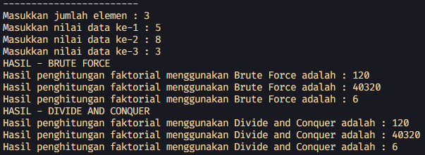
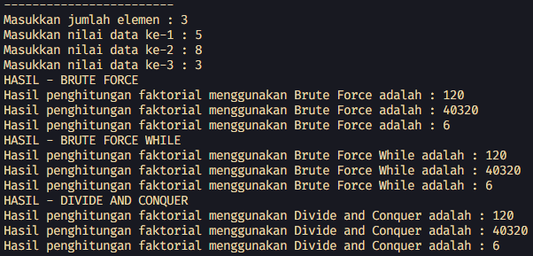
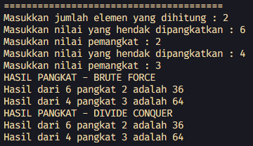
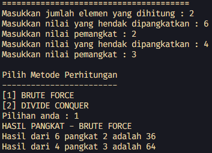
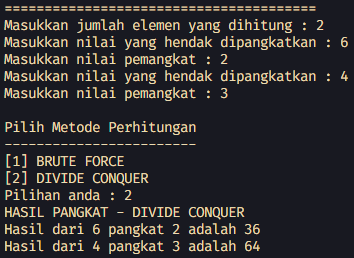
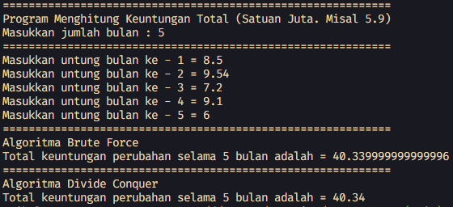
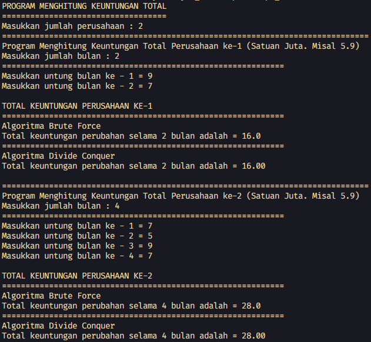
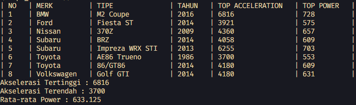

# <p align="center">LAPORAN JOBSHEET IV - BRUTE FORCE DAN DIVIDE CONQUER</p>

### **IDENTITAS MAHASISWA**
**Nama :** Haikal Muhammad Rafli<br>
**NIM :** 2341720008<br>
**Kelas :** TI-1B<br>
**Absen :** 14

## PRAKTIKUM

### **1.0 Percobaan 1: Menghitung Nilai Faktorial dengan Algoritma Brute Force dan Divide and Conquer**

### 1.1 Kode Percobaan :

``Faktorial.java`` <br>
```java
public class Faktorial {

    public int nilai;

    int faktorialBF(int n) {
        int fakto = 1;
        for (int i = 1; i <= n; i++) {
            fakto *= i;
        }

        return fakto;
    }

    int faktorialDC(int n) {
        if (n == 1) {
            return 1;
        } else {
            int fakto = n * faktorialDC(n - 1);
            return fakto;
        }
    }

}
```

``MainFaktorial.java`` <br>
```java
import java.util.Scanner;

public class MainFaktorial {

    public static void main(String[] args) {

        Scanner sc = new Scanner(System.in);
        System.out.println("------------------------");
        System.out.print("Masukkan jumlah elemen : ");
        int iJml = sc.nextInt();

        Faktorial fk[] = new Faktorial[iJml];
        for (int i = 0; i < fk.length; i++) {
            fk[i] = new Faktorial();
            System.out.print("Masukkan nilai data ke-" + (i + 1) + " : ");
            fk[i].nilai = sc.nextInt();
        }

        System.out.println("HASIL - BRUTE FORCE");
        for (int i = 0; i < fk.length; i++) {
            System.out.println(
                    "Hasil penghitungan faktorial menggunakan Brute Force adalah : " + fk[i].faktorialBF(fk[i].nilai));
        }

        System.out.println("HASIL - DIVIDE AND CONQUER");
        for (int i = 0; i < fk.length; i++) {
            System.out.println("Hasil penghitungan faktorial menggunakan Divide and Conquer adalah : "
                    + fk[i].faktorialDC(fk[i].nilai));
        }
        sc.close();
    }
}
```

### 1.2 Verifikasi Hasil Percobaan :



### 1.3 Pertanyaan Dan Jawaban :

1. Pada base line Algoritma Divide Conquer untuk melakukan pencarian nilai faktorial, jelaskan perbedaan bagian kode pada penggunaan if dan else! <br>
**Jawaban :** <br> ``Perbedaannya adalah jika kondisi if terpenuhi maka fungsi akan mengembalikan angka 1. Sedangkan jika tidak terpenuhi maka akan melakukan pengalian variable n dengan n-1 sampai n bernilai 1 menggunakan rekursif``

2. Apakah memungkinkan perulangan pada method *faktorialBF()* dirubah selain menggunakan for?Buktikan! <br>
**Jawaban :** <br> ``Bisa, seperti menggunakan loop while(). Contohnya :``

    ```java
    int faktorialBFWhile(int n) {
        int fakto = 1, i = 1;

        while (i <= n) {
            fakto *= i;
            i++;
        }

        return fakto;
    }
    ```

    

3. Jelaskan perbedaan antara "fakto *= i;" dan "int fakto = n * faktorialDC(n-1);" ! <br>
**Jawaban :** <br> ``Perbedaannya adalah jika yang "fakto *= i;" menggunakan perulangan untuk mengalikan variable fakto dengan variable i yang terus terincrement sampai nilainya sama dengan variable input n. Sedangkan yang "int fakto = n * faktorialDC(n-1);" memberikan nilai ke variable fakto dengan nilai hasil perkalian variable input n secara berulang dengan variable n yang dikurangi 1 sampai n bernilai 1 dengan menggunakan rekursif``

<br><hr>

### **2.0 Percobaan 2: Menghitung Hasil Pangkat dengan Algoritma Brute Force dan Divide and Conquer**

### 2.1 Kode Percobaan :

``Pangkat.java`` <br>
```java
public class Pangkat {

    public int nilai, pangkat;

    int pangkatBf(int a, int n) {
        int hasil = a;

        for (int i = 1; i < n; i++) {
            hasil *= a;
        }

        return hasil;
    }

    int pangkatDc(int a, int n) {
        if (n == 1) {
            return a;
        } else {
            if (n % 2 == 1) {
                return (pangkatDc(a, n / 2) * pangkatDc(a, n / 2) * a);
            } else {
                return (pangkatDc(a, n / 2) * pangkatDc(a, n / 2));
            }
        }
    }
}
```

``MainPangkat.java`` <br>
```java
import java.util.Scanner;

public class MainPangkat {

    public static void main(String[] args) {

        Scanner sc = new Scanner(System.in);

        System.out.println("=======================================");
        System.out.print("Masukkan jumlah elemen yang dihitung : ");
        int elemen = sc.nextInt();
        sc.nextLine();

        Pangkat png[] = new Pangkat[elemen];
        for (int i = 0; i < png.length; i++) {
            png[i] = new Pangkat();
            System.out.print("Masukkan nilai yang hendak dipangkatkan : ");
            png[i].nilai = sc.nextInt();
            sc.nextLine();
            System.out.print("Masukkan nilai pemangkat : ");
            png[i].pangkat = sc.nextInt();
        }

        System.out.println("HASIL PANGKAT - BRUTE FORCE");
        for (int i = 0; i < png.length; i++) {
            System.out.println("Hasil dari " + png[i].nilai + " pangkat " + png[i].pangkat + " adalah "
                    + png[i].pangkatBf(png[i].nilai, png[i].pangkat));
        }

        System.out.println("HASIL PANGKAT - DIVIDE CONQUER");
        for (int i = 0; i < png.length; i++) {
            System.out.println("Hasil dari " + png[i].nilai + " pangkat " + png[i].pangkat + " adalah "
                    + png[i].pangkatDc(png[i].nilai, png[i].pangkat));
        }

        sc.close();
    }
}
```

### 2.2 Verifikasi Hasil Percobaan :



### 2.3 Pertanyaan Dan Jawaban :

1. Jelaskan mengenai perbedaan 2 method yang dibuat yaitu PangkatBF() dan PangkatDC()! <br>
**Jawaban :** <br> ``Perbedaannya adalah yang PangkatBF() mengalikan variable input nilai a dengan dirinya sendiri dengan cara disimpan dalam variable hasil dan dikalikan variable a secara terus menerus sampai perulangan for i memiliki nilai yang sama dengan variable input pangkat b. Sedangkan yang PangkatDC() menggunakan rekursif untuk membagi n agar hasil fungsi menjadi beberapa cabang untuk dikalikan variable a-nya disetiap pemanggilan fungsi``

2. Apakah tahap combine sudah termasuk dalam kode tersebut?Tunjukkan! <br>
**Jawaban :** <br> ``Iya, sudah terdapat tahap combine. Berikut buktinya : ``

    ```java
    return (pangkatDc(a, n / 2) * pangkatDc(a, n / 2) * a);
    ```

    ``dan``

    ```java
    return (pangkatDc(a, n / 2) * pangkatDc(a, n / 2));
    ```

    ``Ditunjukkan dari penggabungan hasil hitung menjadi hasil akhir``

3. Modifikasi kode program tersebut, anggap proses pengisian atribut dilakukan dengan konstruktor. <br>
**Jawaban :** <br> ``Kode Program :``

    ``Pangkat.java`` <br>
    ```java
    public class Pangkat {

        public int nilai, pangkat;

        Pangkat(int nilai, int pangkat) {
            this.nilai = nilai;
            this.pangkat = pangkat;
        }

        int pangkatBf(int a, int n) {
            int hasil = a;

            for (int i = 1; i < n; i++) {
                hasil *= a;
            }

            return hasil;
        }

        int pangkatDc(int a, int n) {
            if (n == 1) {
                return a;
            } else {
                if (n % 2 == 1) {
                    return (pangkatDc(a, n / 2) * pangkatDc(a, n / 2) * a);
                } else {
                    return (pangkatDc(a, n / 2) * pangkatDc(a, n / 2));
                }
            }
        }
    }
    ```

    ``MainPangkat.java`` <br>
    ```java
    import java.util.Scanner;

    public class MainPangkat {

        public static void main(String[] args) {

            Scanner sc = new Scanner(System.in);

            System.out.println("=======================================");
            System.out.print("Masukkan jumlah elemen yang dihitung : ");
            int elemen = sc.nextInt();
            sc.nextLine();

            Pangkat png[] = new Pangkat[elemen];
            for (int i = 0; i < png.length; i++) {
                System.out.print("Masukkan nilai yang hendak dipangkatkan : ");
                int nilai = sc.nextInt();
                sc.nextLine();
                System.out.print("Masukkan nilai pemangkat : ");
                int pangkat = sc.nextInt();
                png[i] = new Pangkat(nilai, pangkat);
            }

            System.out.println("HASIL PANGKAT - BRUTE FORCE");
            for (int i = 0; i < png.length; i++) {
                System.out.println("Hasil dari " + png[i].nilai + " pangkat " + png[i].pangkat + " adalah "
                        + png[i].pangkatBf(png[i].nilai, png[i].pangkat));
            }

            System.out.println("HASIL PANGKAT - DIVIDE CONQUER");
            for (int i = 0; i < png.length; i++) {
                System.out.println("Hasil dari " + png[i].nilai + " pangkat " + png[i].pangkat + " adalah "
                        + png[i].pangkatDc(png[i].nilai, png[i].pangkat));
            }

            sc.close();
        }
    }
    ```

4. Tambahkan menu agar salah satu method yang terpilih saja yang akan dijalankan menggunakan switch-case! <br>
**Jawaban :** <br> ``Perubahan Kode :``

    ``MainPangkat.java`` <br>
    ```java
    import java.util.Scanner;

    public class MainPangkat {

        public static void main(String[] args) {

            Scanner sc = new Scanner(System.in);

            System.out.println("=======================================");
            System.out.print("Masukkan jumlah elemen yang dihitung : ");
            int elemen = sc.nextInt();
            sc.nextLine();

            Pangkat png[] = new Pangkat[elemen];
            for (int i = 0; i < png.length; i++) {
                System.out.print("Masukkan nilai yang hendak dipangkatkan : ");
                int nilai = sc.nextInt();
                sc.nextLine();
                System.out.print("Masukkan nilai pemangkat : ");
                int pangkat = sc.nextInt();
                png[i] = new Pangkat(nilai, pangkat);
            }

            System.out.println("\nPilih Metode Perhitungan");
            System.out.println("------------------------");
            System.out.println("[1] BRUTE FORCE");
            System.out.println("[2] DIVIDE CONQUER");
            System.out.print("Pilihan anda : ");

            switch (sc.nextInt()) {
                case 1:
                    System.out.println("HASIL PANGKAT - BRUTE FORCE");
                    for (int i = 0; i < png.length; i++) {
                        System.out.println("Hasil dari " + png[i].nilai + " pangkat " + png[i].pangkat + " adalah "
                                + png[i].pangkatBf(png[i].nilai, png[i].pangkat));
                    }
                    break;

                case 2:
                    System.out.println("HASIL PANGKAT - DIVIDE CONQUER");
                    for (int i = 0; i < png.length; i++) {
                        System.out.println("Hasil dari " + png[i].nilai + " pangkat " + png[i].pangkat + " adalah "
                                + png[i].pangkatDc(png[i].nilai, png[i].pangkat));
                    }
                    break;

                default:
                    System.out.println("Invalid choice!");
                    break;
            }

            sc.close();
        }
    }
    ```

    ``Hasil Program : ``

    ``BRUTE FORCE`` <br>
    

    ``DIVIDE CONQUER`` <br>
    


<br><hr>

### **3.0 Percobaan 3: Menghitung Sum Array dengan Algoritma Brute Force dan Divide and Conquer**

### 3.1 Kode Percobaan :

``Sum.java`` <br>
```java

public class Sum {
    int elemen;
    double keuntungan[], total;

    Sum(int elemen) {
        this.elemen = elemen;
        this.keuntungan = new double[elemen];
        this.total = 0;
    }

    double totalBF(double arr[]) {
        for (int i = 0; i < arr.length; i++) {
            total = total + arr[i];
        }
        return total;
    }

    double totalDC(double arr[], int l, int r) {
        if (l == r) {
            return arr[l];

        } else if (l < r) {
            int mid = (r + l) / 2;
            double lsum = totalDC(arr, l, mid - 1);
            double rsum = totalDC(arr, mid + 1, r);

            return lsum + rsum + arr[mid];
        }

        return 0;
    }
}
```

``MainSum.java`` <br>
```java
import java.util.Scanner;

public class MainSum {

    public static void main(String[] args) {

        Scanner sc = new Scanner(System.in);

        System.out.println("============================================================");
        System.out.println("Program Menghitung Keuntungan Total (Satuan Juta. Misal 5.9)");
        System.out.print("Masukkan jumlah bulan : ");
        int elm = sc.nextInt();
        sc.nextLine();

        Sum sm = new Sum(elm);
        System.out.println("============================================================");
        for (int i = 0; i < sm.elemen; i++) {
            System.out.print("Masukkan untung bulan ke - " + (i + 1) + " = ");
            sm.keuntungan[i] = sc.nextDouble();
            sc.nextLine();
        }

        System.out.println("============================================================");
        System.out.println("Algoritma Brute Force");
        System.out.println("Total keuntungan perubahan selama " + sm.elemen + " bulan adalah = "
                + sm.totalBF(sm.keuntungan));
        System.out.println("============================================================");
        System.out.println("Algoritma Divide Conquer");
        System.out.printf("Total keuntungan perubahan selama %d bulan adalah = %.2f", sm.elemen,
                sm.totalDC(sm.keuntungan, 0, sm.elemen - 1));

        sc.close();
    }
}
```

### 3.2 Verifikasi Hasil Percobaan :



### 3.3 Pertanyaan Dan Jawaban :

1. Mengapa terdapat formulasi return value berikut?Jelaskan! ```java return lsum + rsum + arr[mid];``` <br>
**Jawaban :** <br> ``Formulasi return tersebut untuk mengembalikan nilai hasil jumlah penjumlahan sisi kiri, penjumlahan sisi kanan, dan nilai di indeks tengah array``

1. Kenapa dibutuhkan variable mid pada method TotalDC()? <br>
**Jawaban :** <br> ``Variable mid digunakan untuk membagi array menjadi 2 bagian. Yaitu bagian kiri dan kanan``

1. Program perhitungan keuntungan suatu perusahaan ini hanya untuk satu perusahaan saja. Bagaimana cara menghitung sekaligus keuntungan beberapa bulan untuk beberapa perusahaan.(Setiap perusahaan bisa saja memiliki jumlah bulan berbeda-beda)? Buktikan dengan program! <br>
**Jawaban :** <br> ``Kode Program :``

    ``MainSum.java``
    ```java
    import java.util.Scanner;

    public class MainSum {

        public static void main(String[] args) {

            Scanner sc = new Scanner(System.in);

            System.out.println("PROGRAM MENGHITUNG KEUNTUNGAN TOTAL");
            System.out.println("===================================");
            System.out.print("Masukkan jumlah perusahaan : ");
            int jml = sc.nextInt();

            for (int i = 1; i <= jml; i++) {
                System.out.println("==============================================================================");
                System.out.println("Program Menghitung Keuntungan Total Perusahaan ke-" + i + " (Satuan Juta. Misal 5.9)");
                System.out.print("Masukkan jumlah bulan : ");
                int elm = sc.nextInt();
                sc.nextLine();

                Sum sm = new Sum(elm);
                System.out.println("============================================================");
                for (int j = 0; j < sm.elemen; j++) {
                    System.out.print("Masukkan untung bulan ke - " + (j + 1) + " = ");
                    sm.keuntungan[j] = sc.nextDouble();
                    sc.nextLine();
                }

                System.out.println("\nTOTAL KEUNTUNGAN PERUSAHAAN KE-" + i);
                System.out.println("============================================================");
                System.out.println("Algoritma Brute Force");
                System.out.println("Total keuntungan perubahan selama " + sm.elemen + " bulan adalah = "
                        + sm.totalBF(sm.keuntungan));
                System.out.println("============================================================");
                System.out.println("Algoritma Divide Conquer");
                System.out.printf("Total keuntungan perubahan selama %d bulan adalah = %.2f\n", sm.elemen,
                        sm.totalDC(sm.keuntungan, 0, sm.elemen - 1));
                System.out.println();
            }

            sc.close();
        }
    }
    ```

    ``Hasil Program :``

    

<br><hr>

### **4.0 Latihan Praktikum**

### 4.1 Kode Percobaan :

``Mobil.java`` <br>
```java
public class Mobil {

    String merk, tipe;
    int tahun, top_acceleration, top_power;

    Mobil(String merk, String tipe, int tahun, int top_acceleration, int top_power) {
        this.merk = merk;
        this.tipe = tipe;
        this.tahun = tahun;
        this.top_acceleration = top_acceleration;
        this.top_power = top_power;
    }

    int getHighestAccel(Mobil arr[], int l, int r) {
        if (l == r) {
            return arr[l].top_acceleration;
        }

        int mid = (r + l) / 2;

        int lHighest = getHighestAccel(arr, l, mid);
        int rHighest = getHighestAccel(arr, mid + 1, r);

        return Math.max(lHighest, rHighest);
    }

    int getLowestAccel(Mobil arr[], int l, int r) {
        if (l == r) {
            return arr[l].top_acceleration;
        }

        int mid = (r + l) / 2;

        int lLowest = getLowestAccel(arr, l, mid);
        int rLowest = getLowestAccel(arr, mid + 1, r);

        return Math.min(lLowest, rLowest);
    }

    double getAvgTopPower(Mobil arr[]) {
        double total = 0;

        for (int i = 0; i < arr.length; i++) {
            total += arr[i].top_power;
        }

        return total / arr.length;
    }
}
```

``MobilMain.java`` <br>
```java
public class MobilMain {

    static String[][] data = {
            { "BMW", "M2 Coupe", "2016", "6816", "728" },
            { "Ford", "Fiesta ST", "2014", "3921", "575" },
            { "Nissan", "370Z", "2009", "4360", "657" },
            { "Subaru", "BRZ", "2014", "4058", "609" },
            { "Subaru", "Impreza WRX STI", "2013", "6255", "703" },
            { "Toyota", "AE86 Trueno", "1986", "3700", "553" },
            { "Toyota", "86/GT86", "2014", "4180", "609" },
            { "Volkswagen", "Golf GTI", "2014", "4180", "631" }
    };

    static void showData() {
        System.out.printf("| %-4s | %-12s | %-17s | %-7s | %-18s | %-11s |\n", "NO", "MERK", "TIPE", "TAHUN",
                "TOP ACCELERATION",
                "TOP POWER");

        for (int i = 0; i < data.length; i++) {
            System.out.printf("| %-4s | %-12s | %-17s | %-7s | %-18s | %-11s |\n",
                    i + 1,
                    data[i][0],
                    data[i][1],
                    data[i][2],
                    data[i][3],
                    data[i][4]);
        }
    }

    public static void main(String[] args) {

        Mobil mobil[] = new Mobil[8];

        for (int i = 0; i < mobil.length; i++) {
            mobil[i] = new Mobil(data[i][0], data[i][1], Integer.parseInt(data[i][2]), Integer.parseInt(data[i][3]),
                    Integer.parseInt(data[i][4]));
        }

        showData();

        System.out.println("Akselerasi Tertinggi : " + mobil[0].getHighestAccel(mobil, 0, mobil.length - 1));
        System.out.println("Akselerasi Terendah : " + mobil[0].getLowestAccel(mobil, 0, mobil.length - 1));
        System.out.println("Rata-rata Power : " + mobil[0].getAvgTopPower(mobil));
    }
}
```

### 4.2 Verifikasi Hasil Percobaan :

