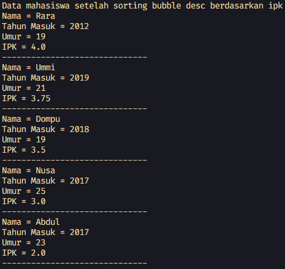
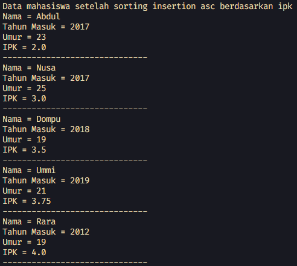
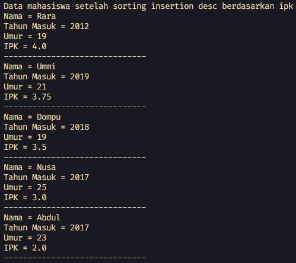
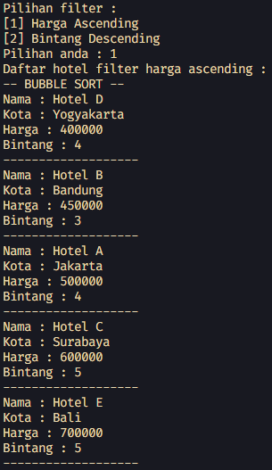
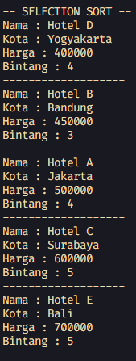
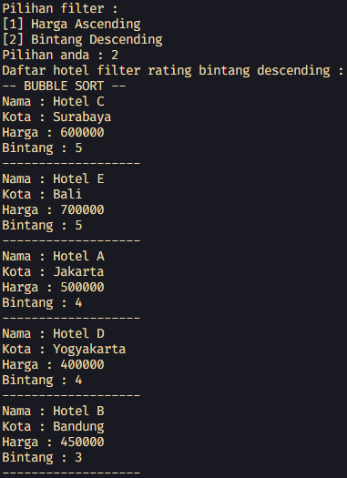
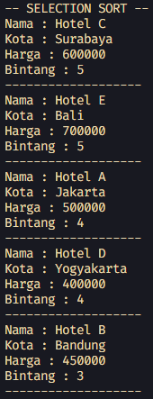

# <p align="center">LAPORAN JOBSHEET V - SORTING (BUBBLE, SELECTION, DAN INSERTION SORT)</p>

### **IDENTITAS MAHASISWA**
**Nama :** Haikal Muhammad Rafli<br>
**NIM :** 2341720008<br>
**Kelas :** TI-1B<br>
**Absen :** 14

## PRAKTIKUM

### **1.0 Percobaan 1: Mengurutkan Data Mahasiswa Berdasarkan IPK Menggunakan Bubble Sort**

### 1.1 Kode Percobaan :

``Mahasiswa.java`` <br>
```java
public class Mahasiswa {

    String nama;
    int thnMasuk, umur;
    double ipk;

    Mahasiswa(String n, int t, int u, double i) {
        nama = n;
        thnMasuk = t;
        umur = u;
        ipk = i;
    }

    void tampil() {
        System.out.println("Nama = " + nama);
        System.out.println("Tahun Masuk = " + thnMasuk);
        System.out.println("Umur = " + umur);
        System.out.println("IPK = " + ipk);
    }
}
```

``DaftarMahasiswaBerprestasi.java`` <br>
```java
public class DaftarMahasiswaBerprestasi {

    Mahasiswa listMhs[] = new Mahasiswa[5];
    int idx;

    void tambah(Mahasiswa m) {
        if (idx < listMhs.length) {
            listMhs[idx] = m;
            idx++;
        } else {
            System.out.println("Data sudah penuh!");
        }
    }

    void tampil() {
        for (Mahasiswa m : listMhs) {
            m.tampil();
            System.out.println("------------------------------");
        }
    }

    void bubbleSort() {
        for (int i = 0; i < listMhs.length - 1; i++) {
            for (int j = 1; j < listMhs.length - i; j++) {
                if (listMhs[j].ipk > listMhs[j - 1].ipk) {
                    Mahasiswa tmp = listMhs[j];
                    listMhs[j] = listMhs[j - 1];
                    listMhs[j - 1] = tmp;
                }
            }
        }
    }
}
```

``MahasiswaMain.java`` <br>
```java
public class MahasiswaMain {

    public static void main(String[] args) {

        DaftarMahasiswaBerprestasi list = new DaftarMahasiswaBerprestasi();
        Mahasiswa m1 = new Mahasiswa("Nusa", 2017, 25, 3);
        Mahasiswa m2 = new Mahasiswa("Rara", 2012, 19, 4);
        Mahasiswa m3 = new Mahasiswa("Dompu", 2018, 19, 3.5);
        Mahasiswa m4 = new Mahasiswa("Abdul", 2017, 23, 2);
        Mahasiswa m5 = new Mahasiswa("Ummi", 2019, 21, 3.75);

        list.tambah(m1);
        list.tambah(m2);
        list.tambah(m3);
        list.tambah(m4);
        list.tambah(m5);

        System.out.println("Data mahasiswa sebelum sorting = ");
        list.tampil();

        System.out.println("Data mahasiswa setelah sorting bubble desc berdasarkan ipk");
        list.bubbleSort();
        list.tampil();
    }
}
```

### 1.2 Verifikasi Hasil Percobaan :




### 1.3 Pertanyaan Dan Jawaban :

1. Terdapat di method apakah proses bubble sort? <br>
**Jawaban :** <br> ``Terdapat di method void bubbleSort yang ada di dalam class DaftarMahasiswaBerprestasi.java``

2. Di dalam method bubbleSort(), terdapat baris program seperti di bawah ini: Untuk apakah proses tersebut? <br>
**Jawaban :** <br> ``Proses tersebut adalah untuk mengecek apakah ipk object mahasiswa di array index j lebih besar dari pada yang di array index j-1 / sebelumnya. Jika memang lebih besar maka akan menyimpan object mahasiswa yang di array index j tersebut ke object mahasiswa tmp, lalu mahasiswa di array index j diberikan nilai object mahasiswa dari array index j-1. Kemudian mahasiswa pada index j-1 diberi nilai object dari object mahasiswa tmp``

3. Perhatikan perulangan di dalam bubbleSort() di bawah ini: <br>
   a. Apakah perbedaan antara kegunaan perulangan i dan perulangan j? <br>
    **Jawaban :** <br> ``Perbedaannya adalah perulangan i digunakan untuk melakukan proses sebanyak jumlah index di dalam array listMhs. Sedangkan yang perulangan j digunakan untuk melakukan proses sebanyak jumlah index di dalam array listMhs tetapi dikurangi i. Sehingga setiap variable i bertambah maka jumlah proses yang terjadi di perulangan j berkurang (index yang tidak di berlakukan proses di perulangan j adalah bagian yang sudah disortir)``

    b. Mengapa syarat dari perulangan i adalah i < listMhs.length-1 ? <br>
    **Jawaban :** <br> ``Hal tersebut dikarenakan panjang array dan index terakhir array tidak sama (misalkan panjang array 10, tetapi index terakhir array tersebut adalah 9 karena index array dimulai dari 0). sehingga perulangan i akan terus mengulangi proses sampai variable i tidak lebih kecil dari index yang terakhir``

    c. Mengapa syarat dari perulangan j adalah j < listMhs.length-i ? <br>
    **Jawaban :** <br> ``Hal tersebut dikarenakan agar perulangan prosesnya dilakukan untuk index tertentu dan bukan index yang sudah tersortir``

    d. Jika banyak data di dalam listMhs adalah 50, maka berapakali perulangan i akan berlangsung? Dan ada berapa Tahap bubble sort yang ditempuh? <br>
    **Jawaban :** <br> ``Akan terdapat 49 perulangan i dan terdapat 49 tahapan bubble sort``

<br><hr>

### **2.0 Percobaan 2: Mengurutkan Data Mahasiswa Berdasarkan IPK Menggunakan Selection Sort**

### 2.1 Kode Percobaan :

``DaftarMahasiswaBerprestasi.java`` <br>
```java
public class DaftarMahasiswaBerprestasi {

    Mahasiswa listMhs[] = new Mahasiswa[5];
    int idx;

    void tambah(Mahasiswa m) {
        if (idx < listMhs.length) {
            listMhs[idx] = m;
            idx++;
        } else {
            System.out.println("Data sudah penuh!");
        }
    }

    void tampil() {
        for (Mahasiswa m : listMhs) {
            m.tampil();
            System.out.println("------------------------------");
        }
    }

    // Percobaan 1
    void bubbleSort() {
        for (int i = 0; i < listMhs.length - 1; i++) {
            for (int j = 1; j < listMhs.length - i; j++) {
                if (listMhs[j].ipk > listMhs[j - 1].ipk) {
                    Mahasiswa tmp = listMhs[j];
                    listMhs[j] = listMhs[j - 1];
                    listMhs[j - 1] = tmp;
                }
            }
        }
    }

    // Percobaan 2
    void selectionSort() {
        for (int i = 0; i < listMhs.length - 1; i++) {
            int idxMin = i;
            for (int j = i + 1; j < listMhs.length; j++) {
                if (listMhs[j].ipk < listMhs[idxMin].ipk) {
                    idxMin = j;
                }
            }

            Mahasiswa tmp = listMhs[idxMin];
            listMhs[idxMin] = listMhs[i];
            listMhs[i] = tmp;
        }
    }
```

``MahasiswaMain.java`` <br>
```java
public class MahasiswaMain {

    public static void main(String[] args) {

        DaftarMahasiswaBerprestasi list = new DaftarMahasiswaBerprestasi();
        Mahasiswa m1 = new Mahasiswa("Nusa", 2017, 25, 3);
        Mahasiswa m2 = new Mahasiswa("Rara", 2012, 19, 4);
        Mahasiswa m3 = new Mahasiswa("Dompu", 2018, 19, 3.5);
        Mahasiswa m4 = new Mahasiswa("Abdul", 2017, 23, 2);
        Mahasiswa m5 = new Mahasiswa("Ummi", 2019, 21, 3.75);

        list.tambah(m1);
        list.tambah(m2);
        list.tambah(m3);
        list.tambah(m4);
        list.tambah(m5);

        System.out.println("Data mahasiswa sebelum sorting = ");
        list.tampil();

        // Percobaan 1
        System.out.println("Data mahasiswa setelah sorting bubble desc berdasarkan ipk");
        list.bubbleSort();
        list.tampil();

        // Percobaan 2
        System.out.println("Data mahasiswa setelah sorting selection asc berdasarkan ipk");
        list.selectionSort();
        list.tampil();
    }
}
```

### 2.2 Verifikasi Hasil Percobaan :


### 1.3 Pertanyaan Dan Jawaban :

1. Di dalam method selection sort, terdapat baris program seperti di bawah ini: Untuk apakah proses tersebut, jelaskan! <br>
**Jawaban :** <br> ``Proses pertama adalah memberikan nilai i ke variable idxmin (index minimal). Kemudian dilakukannya perulangan mulai dari index i + 1 sampai sepanjang array listMhs. Yang didalamnya terdapat if else dimana jika ipk mahasiswa index j kurang dari ipk mahasiswa index idxmin, maka idxmin akan diberi nilai j``

<br><hr>

### **3.0 Percobaan 3: Mengurutkan Data Mahasiswa Berdasarkan IPK Menggunakan Insertion Sort**

### 3.1 Kode Percobaan :

``DaftarMahasiswaBerprestasi.java`` <br>
```java
public class DaftarMahasiswaBerprestasi {

    Mahasiswa listMhs[] = new Mahasiswa[5];
    int idx;

    void tambah(Mahasiswa m) {
        if (idx < listMhs.length) {
            listMhs[idx] = m;
            idx++;
        } else {
            System.out.println("Data sudah penuh!");
        }
    }

    void tampil() {
        for (Mahasiswa m : listMhs) {
            m.tampil();
            System.out.println("------------------------------");
        }
    }

    // Percobaan 1
    void bubbleSort() {
        for (int i = 0; i < listMhs.length - 1; i++) {
            for (int j = 1; j < listMhs.length - i; j++) {
                if (listMhs[j].ipk > listMhs[j - 1].ipk) {
                    Mahasiswa tmp = listMhs[j];
                    listMhs[j] = listMhs[j - 1];
                    listMhs[j - 1] = tmp;
                }
            }
        }
    }

    // Percobaan 2
    void selectionSort() {
        for (int i = 0; i < listMhs.length - 1; i++) {
            int idxMin = i;
            for (int j = i + 1; j < listMhs.length; j++) {
                if (listMhs[j].ipk < listMhs[idxMin].ipk) {
                    idxMin = j;
                }
            }

            Mahasiswa tmp = listMhs[idxMin];
            listMhs[idxMin] = listMhs[i];
            listMhs[i] = tmp;
        }
    }

    // Percobaan 3
    void insertionSort() {
        for (int i = 1; i < listMhs.length; i++) {
            Mahasiswa temp = listMhs[i];
            int j = i;
            while (j > 0 && listMhs[j - 1].ipk > temp.ipk) {
                listMhs[j] = listMhs[j - 1];
                j--;
            }
            listMhs[j] = temp;
        }
    }
}
```

``MahasiswaMain.java`` <br>
```java
public class MahasiswaMain {

    public static void main(String[] args) {

        DaftarMahasiswaBerprestasi list = new DaftarMahasiswaBerprestasi();
        Mahasiswa m1 = new Mahasiswa("Nusa", 2017, 25, 3);
        Mahasiswa m2 = new Mahasiswa("Rara", 2012, 19, 4);
        Mahasiswa m3 = new Mahasiswa("Dompu", 2018, 19, 3.5);
        Mahasiswa m4 = new Mahasiswa("Abdul", 2017, 23, 2);
        Mahasiswa m5 = new Mahasiswa("Ummi", 2019, 21, 3.75);

        list.tambah(m1);
        list.tambah(m2);
        list.tambah(m3);
        list.tambah(m4);
        list.tambah(m5);

        System.out.println("Data mahasiswa sebelum sorting = ");
        list.tampil();

        // Percobaan 1
        System.out.println("Data mahasiswa setelah sorting bubble desc berdasarkan ipk");
        list.bubbleSort();
        list.tampil();

        // Percobaan 2
        System.out.println("Data mahasiswa setelah sorting selection asc berdasarkan ipk");
        list.selectionSort();
        list.tampil();

        // Percobaan 3
        System.out.println("Data mahasiswa setelah sorting insertion asc berdasarkan ipk");
        list.insertionSort();
        list.tampil();
    }
}
```

### 3.2 Verifikasi Hasil Percobaan :




### 3.3 Pertanyaan Dan Jawaban :

1. Ubahlah fungsi pada InsertionSort sehingga fungsi ini dapat melaksanakan proses sorting dengan cara descending. <br>
**Jawaban :** <br> 

    ```java
    void insertionSort() {
        for (int i = 1; i < listMhs.length; i++) {
            Mahasiswa temp = listMhs[i];
            int j = i;
            while (j > 0 && listMhs[j - 1].ipk < temp.ipk) {
                listMhs[j] = listMhs[j - 1];
                j--;
            }
            listMhs[j] = temp;
        }
    }
    ```

    ``Hasil Kode Program`` <br>

    

<br><hr>

### **4.0 Latihan Praktikum**

### 4.1 Kode Percobaan :

``Hotel.java`` <br>
```java
public class Hotel {
    String nama, kota;
    int harga;
    byte bintang;

    Hotel(String n, String k, int h, byte b) {
        nama = n;
        kota = k;
        harga = h;
        bintang = b;
    }
}
```

``HotelService.java`` <br>
```java
public class HotelService {

    Hotel rooms[] = new Hotel[5];
    int idx;

    void tambah(Hotel h) {
        if (idx < rooms.length) {
            rooms[idx] = h;
            idx++;
        } else {
            System.out.println("Data sudah penuh!");
        }
    }

    void tampilAll() {
        for (Hotel h : rooms) {
            System.out.println("Nama : " + h.nama);
            System.out.println("Kota : " + h.kota);
            System.out.println("Harga : " + h.harga);
            System.out.println("Bintang : " + h.bintang);
            System.out.println("-------------------");
        }
    }

    void bubbleSortHarga() {
        for (int i = 0; i < rooms.length - 1; i++) {
            for (int j = 1; j < rooms.length - i; j++) {
                if (rooms[j].harga < rooms[j - 1].harga) {
                    Hotel temp = rooms[j];
                    rooms[j] = rooms[j - 1];
                    rooms[j - 1] = temp;
                }
            }
        }
    }

    void selectionSortHarga() {
        for (int i = 0; i < rooms.length - 1; i++) {
            int idxMin = i;

            for (int j = i + 1; j < rooms.length; j++) {
                if (rooms[j].harga < rooms[idxMin].harga) {
                    idxMin = j;
                }
            }

            Hotel temp = rooms[idxMin];
            rooms[idxMin] = rooms[i];
            rooms[i] = temp;
        }
    }

    void bubbleSortBintang() {
        for (int i = 0; i < rooms.length - 1; i++) {
            for (int j = 1; j < rooms.length - i; j++) {
                if (rooms[j].bintang > rooms[j - 1].bintang) {
                    Hotel temp = rooms[j];
                    rooms[j] = rooms[j - 1];
                    rooms[j - 1] = temp;
                }
            }
        }
    }

    void selectionSortBintang() {
        for (int i = 0; i < rooms.length - 1; i++) {
            int idxMin = i;

            for (int j = i + 1; j < rooms.length; j++) {
                if (rooms[j].bintang > rooms[idxMin].bintang) {
                    idxMin = j;
                }
            }

            Hotel temp = rooms[idxMin];
            rooms[idxMin] = rooms[i];
            rooms[i] = temp;
        }
    }
}
```

``HotelMain.java`` <br>
```java
import java.util.Scanner;

public class HotelMain {

    public static void main(String[] args) {

        Scanner sc = new Scanner(System.in);

        String[][] dummyHotel = {
                { "Hotel A", "Jakarta", "500000", "4" },
                { "Hotel B", "Bandung", "450000", "3" },
                { "Hotel C", "Surabaya", "600000", "5" },
                { "Hotel D", "Yogyakarta", "400000", "4" },
                { "Hotel E", "Bali", "700000", "5" }
        };

        HotelService list = new HotelService();

        Hotel listHotel[] = new Hotel[dummyHotel.length];

        for (int i = 0; i < listHotel.length; i++) {
            listHotel[i] = new Hotel(dummyHotel[i][0], dummyHotel[i][1], Integer.parseInt(dummyHotel[i][2]),
                    Byte.parseByte(
                            dummyHotel[i][3]));
        }

        for (Hotel h : listHotel) {
            list.tambah(h);
        }

        System.out.println("Daftar hotel sebelum diurutkan : ");
        list.tampilAll();
        System.out.println();

        System.out.println("Pilihan filter :");
        System.out.println("[1] Harga Ascending");
        System.out.println("[2] Bintang Descending");
        System.out.print("Pilihan anda : ");

        switch (sc.nextInt()) {
            case 1:
                System.out.println("Daftar hotel filter harga ascending :");
                System.out.println("-- BUBBLE SORT --");
                list.bubbleSortHarga();
                list.tampilAll();

                System.out.println("-- SELECTION SORT --");
                list.selectionSortHarga();
                list.tampilAll();
                break;

            case 2:
                System.out.println("Daftar hotel filter rating bintang descending :");
                System.out.println("-- BUBBLE SORT --");
                list.bubbleSortBintang();
                list.tampilAll();

                System.out.println("-- SELECTION SORT --");
                list.selectionSortBintang();
                list.tampilAll();
                break;

            default:
                System.out.println("Invalid choice!");
                break;
        }

        sc.close();
    }
}
```

### 4.2 Verifikasi Hasil Praktikum :

``Bubble Sort Harga Ascending`` <br>


``Selection Sort Harga Ascending`` <br>


``Bubble Sort Rating Bintang Descending`` <br>


``Selection Sort Rating Bintang Descending`` <br>
