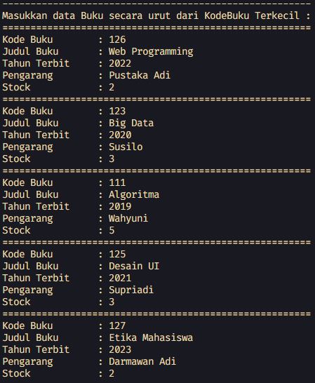

# <p align="center">LAPORAN JOBSHEET VI - SEARCHING</p>

### **IDENTITAS MAHASISWA**
**Nama :** Haikal Muhammad Rafli<br>
**NIM :** 2341720008<br>
**Kelas :** TI-1B<br>
**Absen :** 14

## PRAKTIKUM

### **1.0 Percobaan 1: Searching / Pencarian Menggunakan Agoritma Sequential Search**

### 1.1 Kode Percobaan :

``Buku14.java`` <br>
```java
public class Buku14 {

    int kodeBuku;
    String judulBuku;
    int tahunTerbit;
    String pengarang;
    int stock;

    public Buku14(int kodeBuku, String judulBuku, int tahunTerbit, String pengarang, int stock) {
        this.kodeBuku = kodeBuku;
        this.judulBuku = judulBuku;
        this.tahunTerbit = tahunTerbit;
        this.pengarang = pengarang;
        this.stock = stock;
    }

    public void tampilDataBuku() {
        System.out.println("=======================");
        System.out.println("Kode Buku : " + kodeBuku);
        System.out.println("Judul Buku : " + judulBuku);
        System.out.println("Tahun Terbit : " + tahunTerbit);
        System.out.println("Pengarang : " + pengarang);
        System.out.println("Stock : " + stock);
    }
}
```

``PencarianBuku14.java`` <br>
```java
public class PencarianBuku14 {

    Buku14 listBk[] = new Buku14[5];
    int idx;

    void tambah(Buku14 m) {
        if (idx < listBk.length) {
            listBk[idx] = m;
            idx++;
        } else {
            System.out.println("Data sudah penuh!");
        }
    }

    void tampil() {
        for (Buku14 b : listBk) {
            b.tampilDataBuku();
        }
    }

    public int findSeqSearch(int cari) {
        int posisi = -1;

        for (int i = 0; i < listBk.length; i++) {
            if (listBk[i].kodeBuku == cari) {
                posisi = i;
                break;
            }
        }

        return posisi;
    }

    public void tampilPosisi(int x, int pos) {
        if (pos != -1) {
            System.out.println("Data : " + x + " ditemukan pada indeks " + pos);
        } else {
            System.out.println("Data : " + x + " tidak ditemukan!");
        }
    }

    public void tampilData(int x, int pos) {
        if (pos != -1) {
            System.out.println("Kode Buku\t : " + x);
            System.out.println("Judul Buku\t : " + listBk[pos].judulBuku);
            System.out.println("Tahun Terbit\t : " + listBk[pos].tahunTerbit);
            System.out.println("Pengarang\t : " + listBk[pos].pengarang);
            System.out.println("Stock\t \t : " + listBk[pos].stock);
        } else {
            System.out.println("Data : " + x + " tidak ditemukan!");
        }
    }
}
```

``Buku14.java`` <br>
```java
import java.util.Scanner;

public class BukuMain14 {

    public static void main(String[] args) {

        Scanner sc = new Scanner(System.in);

        PencarianBuku14 data = new PencarianBuku14();
        int jumBuku = 5;

        System.out.println("-------------------------------------------------------");
        System.out.println("Masukkan data Buku secara urut dari KodeBuku Terkecil : ");
        for (int i = 0; i < jumBuku; i++) {
            System.out.println("=======================================================");
            System.out.print("Kode Buku \t : ");
            int kodeBuku = sc.nextInt();
            sc.nextLine();

            System.out.print("Judul Buku \t : ");
            String judulBuku = sc.nextLine();

            System.out.print("Tahun Terbit \t : ");
            int tahunTerbit = sc.nextInt();
            sc.nextLine();

            System.out.print("Pengarang \t : ");
            String pengarang = sc.nextLine();

            System.out.print("Stock \t \t : ");
            int stock = sc.nextInt();
            sc.nextLine();

            Buku14 b = new Buku14(kodeBuku, judulBuku, tahunTerbit, pengarang, stock);
            data.tambah(b);
        }

        System.out.println("-------------------------------------------------------");
        System.out.println("Data Keseluruhan Buku : ");
        data.tampil();

        System.out.println("-------------------------------------------------------");
        System.out.println("Pencarian Data : ");
        System.out.println("Masukkan Kode Buku yang dicari : ");
        System.out.print("Kode Buku : ");
        int cari = sc.nextInt();
        System.out.println("Menggunakan Sequential Search");
        int posisi = data.findSeqSearch(cari);
        data.tampilPosisi(cari, posisi);
        data.tampilData(cari, posisi);

        sc.close();
    }
}
```

### 1.2 Verifikasi Hasil Percobaan :


### 1.3 Pertanyaan Dan Jawaban :

1. Jelaskan fungsi break yang ada pada method FindSeqSearch! <br>
**Jawaban :** <br> ``Fungsi break yang ada pada method findSeqSearch berfungsi untuk menghentikan atau keluar dari looping ketika data yang benar sudah ditemukan``

2. Jika Data Kode Buku yang dimasukkan tidak terurut dari kecil ke besar. Apakah program masih dapat berjalan? Apakah hasil yang dikeluarkan benar? Tunjukkan hasil screenshoot untuk bukti dengan kode Buku yang acak. Jelaskan Mengapa hal tersebut bisa terjadi? <br>
**Jawaban :** <br> ``Masih bisa berjalan dan hasilnya juga benar. Karena sequential search tidak memerlukan data awal yang terurut, karena pencariannya urut dari indeks awal sampai akhir``

    

    

3. Buat method baru dengan nama FindBuku menggunakan konsep sequential search dengan tipe method dari FindBuku adalah BukuNoAbsen. Sehingga Anda bisa memanggil method tersebut pada class BukuMain seperti gambar berikut : <br>
**Jawaban :** <br>
    ```java
        public Buku14 findBuku(int x) {
            int posisi = -1;

            for (int i = 0; i < listBk.length; i++) {
                if (listBk[i].kodeBuku == x) {
                    posisi = i;
                    break;
                }
            }

            return listBk[posisi];
        }
    ```

<br><hr>

### **2.0 Percobaan 2: Searching / Pencarian Menggunakan Binary Search**

### 2.1 Kode Percobaan :

``PencarianBuku14.java`` <br>
```java
public class PencarianBuku14 {

    Buku14 listBk[] = new Buku14[5];
    int idx;

    void tambah(Buku14 m) {
        if (idx < listBk.length) {
            listBk[idx] = m;
            idx++;
        } else {
            System.out.println("Data sudah penuh!");
        }
    }

    void tampil() {
        for (Buku14 b : listBk) {
            b.tampilDataBuku();
        }
    }

    public int findSeqSearch(int cari) {
        int posisi = -1;

        for (int i = 0; i < listBk.length; i++) {
            if (listBk[i].kodeBuku == cari) {
                posisi = i;
                break;
            }
        }

        return posisi;
    }

    public void tampilPosisi(int x, int pos) {
        if (pos != -1) {
            System.out.println("Data : " + x + " ditemukan pada indeks " + pos);
        } else {
            System.out.println("Data : " + x + " tidak ditemukan!");
        }
    }

    public void tampilData(int x, int pos) {
        if (pos != -1) {
            System.out.println("Kode Buku\t : " + x);
            System.out.println("Judul Buku\t : " + listBk[pos].judulBuku);
            System.out.println("Tahun Terbit\t : " + listBk[pos].tahunTerbit);
            System.out.println("Pengarang\t : " + listBk[pos].pengarang);
            System.out.println("Stock\t \t : " + listBk[pos].stock);
        } else {
            System.out.println("Data : " + x + " tidak ditemukan!");
        }
    }

    public Buku14 findBuku(int x) {
        int posisi = -1;

        for (int i = 0; i < listBk.length; i++) {
            if (listBk[i].kodeBuku == x) {
                posisi = i;
                break;
            }
        }

        return listBk[posisi];
    }

    // Percobaan 2
    public int findBinarySearch(int cari, int left, int right) {
        int mid;

        if (right >= left) {
            mid = (left + right) / 2;

            if (cari == listBk[mid].kodeBuku) {
                return (mid);
            } else if (listBk[mid].kodeBuku > cari) {
                return findBinarySearch(cari, left, mid - 1);
            } else {
                return findBinarySearch(cari, mid + 1, right);
            }
        }

        return -1;
    }
}
```

``Buku14Main.java`` <br>
```java
import java.util.Scanner;

public class BukuMain14 {

    public static void main(String[] args) {

        Scanner sc = new Scanner(System.in);

        PencarianBuku14 data = new PencarianBuku14();
        int jumBuku = 5;

        System.out.println("-------------------------------------------------------");
        System.out.println("Masukkan data Buku secara urut dari KodeBuku Terkecil : ");
        for (int i = 0; i < jumBuku; i++) {
            System.out.println("=======================================================");
            System.out.print("Kode Buku \t : ");
            String kodeBuku = sc.nextLine();

            System.out.print("Judul Buku \t : ");
            String judulBuku = sc.nextLine();

            System.out.print("Tahun Terbit \t : ");
            int tahunTerbit = sc.nextInt();
            sc.nextLine();

            System.out.print("Pengarang \t : ");
            String pengarang = sc.nextLine();

            System.out.print("Stock \t \t : ");
            int stock = sc.nextInt();
            sc.nextLine();

            Buku14 b = new Buku14(kodeBuku, judulBuku, tahunTerbit, pengarang, stock);
            data.tambah(b);
        }

        System.out.println("-------------------------------------------------------");
        System.out.println("Data Keseluruhan Buku : ");
        data.tampil();

        System.out.println("-------------------------------------------------------");
        System.out.println("-------------------------------------------------------");
        System.out.println("Pencarian Data : ");
        System.out.println("Masukkan Kode Buku yang dicari : ");
        System.out.print("Kode Buku : ");
        int cari = sc.nextInt();
        System.out.println("Menggunakan Sequential Search");
        int posisi = data.findSeqSearch(cari);
        data.tampilPosisi(cari, posisi);
        data.tampilData(cari, posisi);

        Buku14 dataBuku = data.findBuku(cari);
        dataBuku.tampilDataBuku();

        // Percobaan 2
        System.out.println("=========================");
        System.out.println("Menggunakan Binary Search");
        posisi = data.findBinarySearch(cari, 0, jumBuku - 1);
        data.tampilPosisi(cari, posisi);
        data.tampilData(cari, posisi);

        sc.close();
    }
}
```

### 2.2 Verifikasi Hasil Percobaan :


### 2.3 Pertanyaan Dan Jawaban :

1. Tunjukkan pada kode program yang mana proses divide dijalankan! <br>
**Jawaban :** <br> ``Pada bagian : ``
    ```java
    mid = (left + right) / 2;
    ```

1. Tunjukkan pada kode program yang mana proses conquer dijalankan! <br>
**Jawaban :** <br> ``Pada bagian : ``
    ```java
    if (cari == listBk[mid].kodeBuku) {
        return (mid);
    } else if (listBk[mid].kodeBuku > cari) {
        return findBinarySearch(cari, left, mid - 1);
    } else {
        return findBinarySearch(cari, mid + 1, right);
    }
    ```

1. Jika data Kode Buku yang dimasukkan tidak urut. Apakah program masih dapat berjalan? Mengapa demikian! Tunjukkan hasil screenshoot untuk bukti dengan kode Buku yang acak. Jelaskan Mengapa hal tersebut bisa terjadi?  <br>
**Jawaban :** <br> ``Tidak bisa berjalan, dikarenakan binary search membutuhkan data yang urut agar bisa membagi data-data tersebut menjadi 2 dan dicari ke yang lebih kecil atau ke yang lebih besar.``

    

    

1. Jika Kode Buku yang dimasukkan dari Kode Buku terbesar ke terkecil (missal : 20215, 20214, 20212, 20211, 20210) dan elemen yang dicari adalah 20210. Bagaimana hasil dari binary search? Apakah sesuai? Jika tidak sesuai maka ubahlah kode program binary seach agar hasilnya sesuai! <br>
**Jawaban :** <br> ``Tidak sesuai, karena binary search yang sebelumnya mencari data yang terurut secara ascending. Modifikasi kode program binary search secara descending :``

    ```java
    public int findBinarySearch(int cari, int left, int right) {
            int mid;

            if (right >= left) {
                mid = (left + right) / 2;

                if (cari == Integer.parseInt(listBk[mid].kodeBuku)) {
                    return (mid);
                } else if (Integer.parseInt(listBk[mid].kodeBuku) < cari) {
                    return findBinarySearch(cari, left, mid - 1);
                } else {
                    return findBinarySearch(cari, mid + 1, right);
                }
            }

            return -1;
        }
    ```

<br><hr>

### **3.0 Percobaan 3: Pengayaan Divide and Conquer**

### 3.1 Kode Percobaan :

``MergeSorting14.java`` <br>
```java
public class MergeSorting14 {

    public void mergeSort(int[] data) {
        sort(data, 0, data.length - 1);
    }

    public void merge(int data[], int left, int middle, int right) {

        int[] temp = new int[data.length];
        for (int i = left; i <= right; i++) {
            temp[i] = data[i];
        }

        int a = left;
        int b = middle + 1;
        int c = left;

        while (a <= middle & b <= right) {
            if (temp[a] <= temp[b]) {
                data[c] = temp[a];
                a++;
            } else {
                data[c] = temp[b];
                b++;
            }

            c++;
        }

        int s = middle - a;
        for (int i = 0; i <= s; i++) {
            data[c + i] = temp[a + i];
        }
    }

    public void sort(int data[], int left, int right) {
        if (left < right) {
            int middle = (left + right) / 2;
            sort(data, left, middle);
            sort(data, middle + 1, right);
            merge(data, left, middle, right);
        }
    }

    public void printArray(int arr[]) {
        for (int i = 0; i < arr.length; i++) {
            System.out.print(arr[i] + " ");
        }

        System.out.println();
    }
}
```

``MergeSortMain14.java`` <br>
```java
public class MergeSortMain14 {

    public static void main(String[] args) {

        int data[] = { 10, 40, 30, 50, 70, 20, 100, 90 };
        System.out.println("=========================");
        System.out.println("Sorting dengan merge sort");
        System.out.println("=========================");

        MergeSorting14 mSort = new MergeSorting14();
        System.out.println("Data awal :");
        mSort.printArray(data);
        mSort.mergeSort(data);
        System.out.println("Setelah diurutkan :");
        mSort.printArray(data);
    }
}
```

### 3.2 Verifikasi Hasil Percobaan :


<br><hr>

### **4.0 Latihan Praktikum**

### 4.1.1 Kode latihan 1 :

``Buku14.java`` <br>
```java
public class Buku14 {

    String kodeBuku;
    String judulBuku;
    int tahunTerbit;
    String pengarang;
    int stock;

    public Buku14(String kodeBuku, String judulBuku, int tahunTerbit, String pengarang, int stock) {
        this.kodeBuku = kodeBuku;
        this.judulBuku = judulBuku;
        this.tahunTerbit = tahunTerbit;
        this.pengarang = pengarang;
        this.stock = stock;
    }

    public void tampilDataBuku() {
        System.out.println("=======================");
        System.out.println("Kode Buku : " + kodeBuku);
        System.out.println("Judul Buku : " + judulBuku);
        System.out.println("Tahun Terbit : " + tahunTerbit);
        System.out.println("Pengarang : " + pengarang);
        System.out.println("Stock : " + stock);
    }
}
```

``PencarianBuku14.java`` <br>
```java
public class PencarianBuku14 {

    Buku14 listBk[] = new Buku14[5];
    int idx;

    void tambah(Buku14 m) {
        if (idx < listBk.length) {
            listBk[idx] = m;
            idx++;
        } else {
            System.out.println("Data sudah penuh!");
        }
    }

    void tampil() {
        for (Buku14 b : listBk) {
            b.tampilDataBuku();
        }
    }

    public int findSeqSearch(int cari) {
        int posisi = -1;

        for (int i = 0; i < listBk.length; i++) {
            if (Integer.parseInt(listBk[i].kodeBuku) == cari) {
                posisi = i;
                break;
            }
        }

        return posisi;
    }

    public void tampilPosisi(int x, int pos) {
        if (pos != -1) {
            System.out.println("Data : " + x + " ditemukan pada indeks " + pos);
        } else {
            System.out.println("Data : " + x + " tidak ditemukan!");
        }
    }

    public void tampilData(int x, int pos) {
        if (pos != -1) {
            System.out.println("Kode Buku\t : " + x);
            System.out.println("Judul Buku\t : " + listBk[pos].judulBuku);
            System.out.println("Tahun Terbit\t : " + listBk[pos].tahunTerbit);
            System.out.println("Pengarang\t : " + listBk[pos].pengarang);
            System.out.println("Stock\t \t : " + listBk[pos].stock);
        } else {
            System.out.println("Data : " + x + " tidak ditemukan!");
        }
    }

    public Buku14 findBuku(int x) {
        int posisi = -1;

        for (int i = 0; i < listBk.length; i++) {
            if (Integer.parseInt(listBk[i].kodeBuku) == x) {
                posisi = i;
                break;
            }
        }

        return listBk[posisi];
    }

    // Percobaan 2
    public int findBinarySearch(int cari, int left, int right) {
        int mid;

        if (right >= left) {
            mid = (left + right) / 2;

            if (cari == Integer.parseInt(listBk[mid].kodeBuku)) {
                return (mid);
            } else if (Integer.parseInt(listBk[mid].kodeBuku) > cari) {
                return findBinarySearch(cari, left, mid - 1);
            } else {
                return findBinarySearch(cari, mid + 1, right);
            }
        }

        return -1;
    }
}
```

``BukuMain14.java`` <br>
```java
public class BukuMain14 {

    public static void main(String[] args) {

        Scanner sc = new Scanner(System.in);

        PencarianBuku14 data = new PencarianBuku14();
        int jumBuku = 5;

        System.out.println("-------------------------------------------------------");
        System.out.println("Masukkan data Buku secara urut dari KodeBuku Terkecil : ");
        for (int i = 0; i < jumBuku; i++) {
            System.out.println("=======================================================");
            System.out.print("Kode Buku \t : ");
            String kodeBuku = sc.nextLine();

            System.out.print("Judul Buku \t : ");
            String judulBuku = sc.nextLine();

            System.out.print("Tahun Terbit \t : ");
            int tahunTerbit = sc.nextInt();
            sc.nextLine();

            System.out.print("Pengarang \t : ");
            String pengarang = sc.nextLine();

            System.out.print("Stock \t \t : ");
            int stock = sc.nextInt();
            sc.nextLine();

            Buku14 b = new Buku14(kodeBuku, judulBuku, tahunTerbit, pengarang, stock);
            data.tambah(b);
        }

        System.out.println("-------------------------------------------------------");
        System.out.println("Data Keseluruhan Buku : ");
        data.tampil();

        System.out.println("-------------------------------------------------------");
        System.out.println("-------------------------------------------------------");
        System.out.println("Pencarian Data : ");
        System.out.println("Masukkan Kode Buku yang dicari : ");
        System.out.print("Kode Buku : ");
        int cari = sc.nextInt();
        System.out.println("Menggunakan Sequential Search");
        int posisi = data.findSeqSearch(cari);
        data.tampilPosisi(cari, posisi);
        data.tampilData(cari, posisi);

        Buku14 dataBuku = data.findBuku(cari);
        dataBuku.tampilDataBuku();

        // Percobaan 2
        System.out.println("=========================");
        System.out.println("Menggunakan Binary Search");
        posisi = data.findBinarySearch(cari, 0, jumBuku - 1);
        data.tampilPosisi(cari, posisi);
        data.tampilData(cari, posisi);

        sc.close();
    }
}
```

### 4.1.2 Verifikasi Hasil Latihan 1 :


<br>

### 4.2.1 Kode latihan 2 :

``PencarianBuku14.java`` <br>
```java
public class PencarianBuku14 {

    Buku14 listBk[] = new Buku14[5];
    int idx;

    void tambah(Buku14 m) {
        if (idx < listBk.length) {
            listBk[idx] = m;
            idx++;
        } else {
            System.out.println("Data sudah penuh!");
        }
    }

    void tampil() {
        for (Buku14 b : listBk) {
            b.tampilDataBuku();
        }
    }

    public int findSeqSearch(int cari) {
        int posisi = -1;

        for (int i = 0; i < listBk.length; i++) {
            if (Integer.parseInt(listBk[i].kodeBuku) == cari) {
                posisi = i;
                break;
            }
        }

        return posisi;
    }

    public void tampilPosisi(int x, int pos) {
        if (pos != -1) {
            System.out.println("Data : " + x + " ditemukan pada indeks " + pos);
        } else {
            System.out.println("Data : " + x + " tidak ditemukan!");
        }
    }

    // judul only variant (Latihan Praktikum)
    public void tampilPosisi(int pos) {
        if (pos != -1) {
            System.out.println("Data ditemukan pada indeks " + pos);
        } else {
            System.out.println("Data tidak ditemukan!");
        }
    }

    public void tampilData(int x, int pos) {
        if (pos != -1) {
            System.out.println("Kode Buku\t : " + x);
            System.out.println("Judul Buku\t : " + listBk[pos].judulBuku);
            System.out.println("Tahun Terbit\t : " + listBk[pos].tahunTerbit);
            System.out.println("Pengarang\t : " + listBk[pos].pengarang);
            System.out.println("Stock\t \t : " + listBk[pos].stock);
        } else {
            System.out.println("Data : " + x + " tidak ditemukan!");
        }
    }

    // judul only variant (Latihan Praktikum)
    public void tampilData(int pos) {
        if (pos != -1) {
            System.out.println("Kode Buku\t : " + listBk[pos].kodeBuku);
            System.out.println("Judul Buku\t : " + listBk[pos].judulBuku);
            System.out.println("Tahun Terbit\t : " + listBk[pos].tahunTerbit);
            System.out.println("Pengarang\t : " + listBk[pos].pengarang);
            System.out.println("Stock\t \t : " + listBk[pos].stock);
        } else {
            System.out.println("Data tidak ditemukan!");
        }
    }

    public Buku14 findBuku(int x) {
        int posisi = -1;

        for (int i = 0; i < listBk.length; i++) {
            if (Integer.parseInt(listBk[i].kodeBuku) == x) {
                posisi = i;
                break;
            }
        }

        return listBk[posisi];
    }

    // Percobaan 2
    public int findBinarySearch(int cari, int left, int right) {
        int mid;

        if (right >= left) {
            mid = (left + right) / 2;

            if (cari == Integer.parseInt(listBk[mid].kodeBuku)) {
                return (mid);
            } else if (Integer.parseInt(listBk[mid].kodeBuku) > cari) {
                return findBinarySearch(cari, left, mid - 1);
            } else {
                return findBinarySearch(cari, mid + 1, right);
            }
        }

        return -1;
    }

    // Latihan Praktikum 2
    public int findJudulSeqSearch(String cari) {
        int posisi = -1;
        int dupe_count = 0;

        for (int i = 0; i < listBk.length; i++) {
            if (listBk[i].judulBuku.equals(cari)) {
                posisi = i;
                dupe_count++;
            }
        }

        if (dupe_count > 1) {
            System.out.println("PERHATIAN!");
            System.out.println("Buku yang judulnya sama ada " + dupe_count);
        }

        return posisi;
    }

    public void selectionSortBuku() {
        for (int i = 0; i < listBk.length - 1; i++) {
            int idxMin = i;

            for (int j = i + 1; j < listBk.length; j++) {
                if (listBk[j].judulBuku.length() == listBk[idxMin].judulBuku.length()) {
                    if (Character.compare(listBk[j].judulBuku.charAt(0), listBk[idxMin].judulBuku.charAt(0)) < 0) {
                        idxMin = j;
                    }
                } else if (listBk[j].judulBuku.length() < listBk[idxMin].judulBuku.length()) {
                    idxMin = j;
                }
            }

            Buku14 temp = listBk[idxMin];
            listBk[idxMin] = listBk[i];
            listBk[i] = temp;
        }
    }

    public int findJudulBinarySearch(String cari, int left, int right) {

        selectionSortBuku();

        int mid;

        if (right >= left) {
            mid = (left + right) / 2;

            if (cari.compareTo(listBk[mid].judulBuku) == 0) {
                return (mid);
            } else if (cari.length() == listBk[mid].judulBuku.length() && cari.compareTo(listBk[mid].judulBuku) < 0) {
                return findJudulBinarySearch(cari, left, mid - 1);
            } else {
                return findJudulBinarySearch(cari, mid + 1, right);
            }
        }

        return -1;
    }
}

```

``BukuMain14.java`` <br>
```java
import java.util.Scanner;

public class BukuMain14 {

    public static void main(String[] args) {

        Scanner sc = new Scanner(System.in);

        PencarianBuku14 data = new PencarianBuku14();
        int jumBuku = 5;

        System.out.println("-------------------------------------------------------");
        System.out.println("Masukkan data Buku secara urut dari KodeBuku Terkecil : ");
        for (int i = 0; i < jumBuku; i++) {
            System.out.println("=======================================================");
            System.out.print("Kode Buku \t : ");
            String kodeBuku = sc.nextLine();

            System.out.print("Judul Buku \t : ");
            String judulBuku = sc.nextLine();

            System.out.print("Tahun Terbit \t : ");
            int tahunTerbit = sc.nextInt();
            sc.nextLine();

            System.out.print("Pengarang \t : ");
            String pengarang = sc.nextLine();

            System.out.print("Stock \t \t : ");
            int stock = sc.nextInt();
            sc.nextLine();

            Buku14 b = new Buku14(kodeBuku, judulBuku, tahunTerbit, pengarang, stock);
            data.tambah(b);
        }

        System.out.println("-------------------------------------------------------");
        System.out.println("Data Keseluruhan Buku : ");
        data.tampil();

        System.out.println("-------------------------------------------------------");
        System.out.println("-------------------------------------------------------");
        System.out.println("Pencarian Data : ");
        System.out.println("Masukkan Judul Buku yang dicari : ");
        System.out.print("Judul Buku : ");
        String cari = sc.nextLine();
        System.out.println("Menggunakan Sequential Search");
        int posisi = data.findJudulSeqSearch(cari);
        data.tampilPosisi(posisi);
        data.tampilData(posisi);

        System.out.println("=========================");
        System.out.println("Menggunakan Binary Search");
        posisi = data.findJudulBinarySearch(cari, 0, jumBuku - 1);
        data.tampilPosisi(posisi);
        data.tampilData(posisi);
        data.tampil();

        sc.close();
    }
}

```

### 4.2.2 Verifikasi Hasil Latihan 2 :


