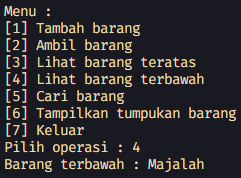

# <p align="center">LAPORAN JOBSHEET VII - STACK</p>

### **IDENTITAS MAHASISWA**
**Nama :** Haikal Muhammad Rafli<br>
**NIM :** 2341720008<br>
**Kelas :** TI-1B<br>
**Absen :** 14

## PRAKTIKUM

### **1.0 Percobaan 1: Penyimpanan Tumpukan Barang dalam Gudang**

### 1.1 Kode Percobaan :

``Barang14.java`` <br>
```java
public class Barang14 {

    int kode;
    String nama;
    String kategori;

    public Barang14(int kode, String nama, String kategori) {
        this.kode = kode;
        this.nama = nama;
        this.kategori = kategori;
    }
}
```

``Gudang14.java`` <br>
```java
public class Gudang14 {

    Barang14 tumpukan[];
    int size;
    int top;

    public Gudang14(int kapasitas) {
        size = kapasitas;
        tumpukan = new Barang14[kapasitas];
        top = -1;
    }

    public boolean cekKosong() {
        if (top == -1) {
            return true;
        } else {
            return false;
        }
    }

    public boolean cekPenuh() {
        if (top == size - 1) {
            return true;
        } else {
            return false;
        }
    }

    public void tambahBarang(Barang14 brg) {
        if (!cekPenuh()) {
            top++;
            tumpukan[top] = brg;
            System.out.println("Barang " + brg.nama + " berhasil ditambahkan ke Gudang");
        } else {
            System.out.println("Gagal! Tumpukan barang di Gudang sudah penuh");
        }
    }

    public Barang14 ambilBarang() {
        if (!cekKosong()) {
            Barang14 delete = tumpukan[top];
            top--;
            System.out.println("Barang " + delete.nama + " diambil dari Gudang");
            return delete;
        } else {
            System.out.println("Tumpukan barang kosong");
            return null;
        }
    }

    public Barang14 lihatBarangTeratas() {
        if (!cekKosong()) {
            Barang14 barangTeratas = tumpukan[top];
            System.out.println("Barang teratas : " + barangTeratas.nama);
            return barangTeratas;
        } else {
            System.out.println("Tumpukan barang kosong");
            return null;
        }
    }

    public void tampilkanBarang() {
        if (!cekKosong()) {
            System.out.println("Rincian tumpukan barang di Gudang :");
            for (int i = top; i >= 0; i--) {
                System.out.printf("Kode %d : %s (Kategori %s)\n", tumpukan[i].kode, tumpukan[i].nama,
                        tumpukan[i].kategori);
            }
        } else {
            System.out.println("Tumpukan barang kosong");
        }
    }
}
```

``Utama14.java`` <br>
```java
import java.util.Scanner;

public class Utama14 {

    public static void main(String[] args) {

        Gudang14 gudang = new Gudang14(7);
        Scanner scanner = new Scanner(System.in);

        while (true) {
            System.out.println("\nMenu : ");
            System.out.println("[1] Tambah barang");
            System.out.println("[2] Ambil barang");
            System.out.println("[3] Tampilkan tumpukan barang");
            System.out.println("[4] Keluar");
            System.out.print("Pilih operasi : ");
            int pilihan = scanner.nextInt();
            scanner.nextLine();

            switch (pilihan) {
                case 1:
                    System.out.print("Masukkan kode barang : ");
                    int kode = scanner.nextInt();
                    scanner.nextLine();
                    System.out.print("Masukkan nama barang : ");
                    String nama = scanner.nextLine();
                    System.out.print("Masukkan nama kategori barang : ");
                    String kategori = scanner.nextLine();
                    Barang14 barangBaru = new Barang14(kode, nama, kategori);
                    gudang.tambahBarang(barangBaru);
                    break;

                case 2:
                    gudang.ambilBarang();
                    break;

                case 3:
                    gudang.tampilkanBarang();
                    break;

                case 4:
                    scanner.close();
                    System.exit(0);
                    break;

                default:
                    System.out.println("Pilihan tidak valid. Silahkan coba lagi");
                    break;
            }
        }
    }
}
```

### 1.2 Verifikasi Hasil Percobaan :


### 1.3 Pertanyaan Dan Jawaban :

1. Lakukan perbaikan pada kode program, sehingga keluaran yang dihasilkan sama dengan verifikasi hasil percobaan! Bagian mana saja yang perlu diperbaiki? <br>
**Jawaban :** <br> ``Terdapat beberapa bagian yang perlu diperbaiki. Tetapi error tersebut sudah saya perbaiki dari awal sehingga output yang dihasillkan sudah benar. Bagian tersebut adalah pada method : ``
<br> ``[1] lihatBarangTeratas() seharusnya bukan !isEmpty() tetapi !cekKosong().`` 
<br> ``[2] tampilkanBarang() loopingnya seharusnya bukan for (int i = 0; i <= top; i++) {} tetapi for (int = top; i >= 0; i--) {}.``
<br> ``[3] Pada switch menu pilihan ke 4 seharusnya ditambahkan system.exit(0) agar keluar dari program.``

2. Berapa banyak data barang yang dapat ditampung di dalam tumpukan? Tunjukkan potongan kode programnya! <br>
**Jawaban :** <br> ``Tumpukannya dapat menampung 7 data, karena pada inisialisasi object gudang diberikan kapasitas 7.``
    ```java
    Gudang14 gudang = new Gudang14(7);
    ```

3. Mengapa perlu pengecekan kondisi !cekKosong() pada method tampilkanBarang? Kalau kondisi tersebut dihapus, apa dampaknya? <br>
**Jawaban :** <br> ``Karena method tampilkanBarang() membutuhkan data didalamnya untuk ditampilkan. Jika kondisi tersebut dihapus maka program akan tetap berjalan walaupun tidak ada data didalamnya dan tidak akan menampilkan apapun.``

4. Modifikasi kode program pada class Utama sehingga pengguna juga dapat memilih operasi lihat barang teratas, serta dapat secara bebas menentukan kapasitas gudang! <br>
**Jawaban :** <br> 
    ```java
    import java.util.Scanner;

    public class Utama14 {

        public static void main(String[] args) {

            Scanner scanner = new Scanner(System.in);

            System.out.println("===========================");
            System.out.print("Masukkan kapasitas Gudang : ");
            Gudang14 gudang = new Gudang14(scanner.nextInt());

            while (true) {
                System.out.println("\nMenu : ");
                System.out.println("[1] Tambah barang");
                System.out.println("[2] Ambil barang");
                System.out.println("[3] Lihat barang teratas");
                System.out.println("[4] Tampilkan tumpukan barang");
                System.out.println("[5] Keluar");
                System.out.print("Pilih operasi : ");
                int pilihan = scanner.nextInt();
                scanner.nextLine();

                switch (pilihan) {
                    case 1:
                        System.out.print("Masukkan kode barang : ");
                        int kode = scanner.nextInt();
                        scanner.nextLine();
                        System.out.print("Masukkan nama barang : ");
                        String nama = scanner.nextLine();
                        System.out.print("Masukkan nama kategori barang : ");
                        String kategori = scanner.nextLine();
                        Barang14 barangBaru = new Barang14(kode, nama, kategori);
                        gudang.tambahBarang(barangBaru);
                        break;

                    case 2:
                        gudang.ambilBarang();
                        break;

                    case 3:
                        gudang.lihatBarangTeratas();
                        break;

                    case 4:
                        gudang.tampilkanBarang();
                        break;

                    case 5:
                        scanner.close();
                        System.exit(0);
                        break;

                    default:
                        System.out.println("Pilihan tidak valid. Silahkan coba lagi");
                        break;
                }
            }
        }
    }
    ```

5. Commit dan push kode program ke Github! <br>
**Jawaban :** <br> ``Commited.``

<br><hr>

### **2.0 Percobaan 2: Konversi Kode Barang ke Biner**

### 2.1 Kode Percobaan :

``StackKonversi14.java`` <br>
```java
public class StackKonversi14 {

    int size;
    int tumpukanBiner[];
    int top;

    public StackKonversi14() {
        this.size = 32; // asumsi 32 bit
        tumpukanBiner = new int[size];
        top = -1;
    }

    public boolean isEmpty() {
        return top == -1;
    }

    public boolean isFull() {
        return top == size - 1;
    }

    public void push(int data) {
        if (isFull()) {
            System.out.println("Stack penuh");
        } else {
            top++;
            tumpukanBiner[top] = data;
        }
    }

    public int pop() {
        if (isEmpty()) {
            System.out.println("Stack kosong");
            return -1;
        } else {
            int data = tumpukanBiner[top];
            top--;
            return data;
        }
    }
}
```

``Gudang14.java`` <br>
```java
public Barang14 ambilBarang() {
    if (!cekKosong()) {
        Barang14 delete = tumpukan[top];
        top--;
        System.out.println("Barang " + delete.nama + " diambil dari Gudang");
        // Percobaan 2
        System.out.println("Kode unik dalam biner : " + konversiDesimalKeBiner(delete.kode));
        return delete;
    } else {
        System.out.println("Tumpukan barang kosong");
        return null;
    }
}

// Percobaan 2
public String konversiDesimalKeBiner(int kode) {
    StackKonversi14 stack = new StackKonversi14();
    while (kode > 0) {
        int sisa = kode % 2;
        stack.push(sisa);

        kode = kode / 2;
    }

    String biner = new String();
    while (!stack.isEmpty()) {
        biner += stack.pop();
    }
    return biner;
}
```

### 2.2 Verifikasi Hasil Percobaan :


### 2.3 Pertanyaan Dan Jawaban :

1. Pada method konversiDesimalKeBiner, ubah kondisi perulangan menjadi while (kode != 0), bagaimana hasilnya? Jelaskan alasannya! <br>
**Jawaban :** <br> ``Hasilnya sama seperti while (kode > 0). Yaitu program akan terus mengulang sampai kode bernilai 0. Bedanya hanya jika kode bernilai negatif, maka perulangan while (kode != 0) akan terus berjalan.``

2. Jelaskan alur kerja dari method konversiDesimalKeBiner! <br>
**Jawaban :** <br> ``Pertama-tama stack StackKonversi dibuat untuk menyimpan setiap angka biner yang dibuat. Kemudian kode yang diinputkan di parameter method akan dikonversi menjadi angka-angka biner di bagian looping while yang melakukan modulus 2 dan pembagian 2 dari kode secara berulang. Lalu angka-angka biner tersebut di keluarkan dari stack dan disimpan kedalam String biner yang kemudian akan direturn oleh methodnya``

<br><hr>

### **3.0 Percobaan 3: Konversi Notasi Infix ke Postfix**

### 3.1 Kode Percobaan :

``Postfix14.java`` <br>
```java
public class Postfix14 {

    char stack[];
    int n;
    int top;

    public Postfix14(int total) {
        n = total;
        top = -1;
        stack = new char[n];
        push('(');
    }

    public void push(char c) {
        top++;
        stack[top] = c;
    }

    public char pop() {
        char item = stack[top];
        top--;
        return item;
    }

    public boolean isOperand(char c) {
        if ((c >= 'A' && c <= 'Z') || (c >= 'a' && c <= 'z') || (c >= '0' && c <= '9') || c == ' ' || c == '.') {
            return true;
        } else {
            return false;
        }
    }

    public boolean isOperator(char c) {
        if (c == '^' || c == '%' || c == '/' || c == '*' || c == '-' || c == '+') {
            return true;
        } else {
            return false;
        }
    }

    public int derajat(char c) {
        switch (c) {
            case '^':
                return 3;
            case '%':
                return 2;
            case '/':
                return 2;
            case '*':
                return 2;
            case '-':
                return 1;
            case '+':
                return 1;
            default:
                return 0;
        }
    }

    public String konversi(String Q) {
        String P = "";
        char c;

        for (int i = 0; i < n; i++) {
            c = Q.charAt(i);

            if (isOperand(c)) {
                P = P + c;
            }

            if (c == '(') {
                push(c);
            }

            if (c == ')') {
                while (stack[top] != '(') {
                    P = P + pop();
                }

                pop();
            }

            if (isOperator(c)) {
                while (derajat(stack[top]) >= derajat(c)) {
                    P = P + pop();
                }

                push(c);
            }
        }

        return P;
    }
}
```

``PostfixMain14.java`` <br>
```java
import java.util.Scanner;

public class PostfixMain14 {

    public static void main(String[] args) {

        Scanner sc = new Scanner(System.in);
        String P, Q;

        System.out.print("Masukkan ekspresi matematika (infix) : ");
        Q = sc.nextLine();
        Q = Q.trim();
        Q = Q + ")";

        int total = Q.length();

        Postfix14 post = new Postfix14(total);
        P = post.konversi(Q);
        System.out.println("Postfix : " + P);

        sc.close();
    }
}
```

### 3.1 Verifikasi Hasil Percobaan :


### 3.3 Pertanyaan Dan Jawaban :

1. Pada method derajat, mengapa return value beberapa case bernilai sama? Apabila return value diubah dengan nilai berbeda-beda setiap case-nya, apa yang terjadi? <br>
**Jawaban :** <br> ``Karena derajat operatornya itu setara. Dan jika nilainya berbeda-beda, maka urutan pengoperasiannya juga akan berbeda-beda. Sehingga hasilnya menjadi salah atau acak``

2. Jelaskan alur kerja method konversi! <br>
**Jawaban :** <br> ``Pertama-tama setiap character pada string input akan di lakukan beberapa pengecekan. Jika character tersebut adalah operand maka akan dimasukkan kedalam String P.Kemudian jika character tersebut berupa buka kurung "(" maka akan dimasukkan kedalam stack. Lalu jika character tersebut berupa tutup kurung ")" maka akan melakukan looping untuk mengambil nilai teratas dalam stack dan memasukkannya ke dalam String P sampai nilai teratas tadi merupakan buka kurung "(". Setelah itu, jika character tersebut berupa operator maka akan melakukan looping yang mengambil nilai teratas dari stack dan memasukkannya ke dalam String P jika derajat operator tersebut lebih besar atau sama dengan operator yang diinputkan. Yang terakhir, String P akan direturn oleh method konversi tersebut.``

1. Pada method konversi, apa fungsi dari potongan kode berikut?Pada method konversi, apa fungsi dari potongan kode berikut? "c = Q.charAt(i);" <br>
**Jawaban :** <br> ``Fungsinya adalah untuk menyimpan character pada index ke i dari String Q ke dalam variable c yang akan digunakan nantinya``

<br><hr>

### **4.0 Latihan Praktikum**

### 4.1 Kode Percobaan :

``Gudang14.java`` <br>
```java
// Latihan Praktikum
public Barang14 lihatBarangTerbawah() {
    if (!cekKosong()) {
        Barang14 barangTerbawah = tumpukan[0];
        System.out.println("Barang terbawah : " + barangTerbawah.nama);
        return barangTerbawah;
    } else {
        System.out.println("Tumpukan barang kosong");
        return null;
    }
}

public void cariBarang(String key) {
    Barang14 barangSesuai[] = new Barang14[size];
    int count = 0;

    // Bagian searching
    for (int i = 0; i < size; i++) {
        if (key.matches("-?\\d+(\\.\\d+)?") && tumpukan[i] != null && tumpukan[i].kode == Integer.parseInt(key)) {
            barangSesuai[count] = tumpukan[i];
            count++;
        } else if (tumpukan[i] != null && tumpukan[i].nama.equalsIgnoreCase(key)) {
            barangSesuai[count] = tumpukan[i];
            count++;
        }
    }

    // Bagian menampilkan
    if (count > 0) {
        System.out.println("--------------------------------");
        System.out.println(count + " barang ditemukan!");

        for (int i = 0; i < barangSesuai.length; i++) {
            if (barangSesuai[i] != null) {
                System.out.println("Kode barang : " + barangSesuai[i].kode);
                System.out.println("Nama barang : " + barangSesuai[i].nama);
                System.out.println("Kategori barang : " + barangSesuai[i].kategori);
                System.out.println("================================");
            }
        }

    } else {
        System.out.println("Tidak ada barang yang ditemukan!");
    }
}
```

``Utama14.java`` <br>
```java
import java.util.Scanner;

public class Utama14 {

    public static void main(String[] args) {

        Scanner scanner = new Scanner(System.in);

        System.out.println("===========================");
        System.out.print("Masukkan kapasitas Gudang : ");
        Gudang14 gudang = new Gudang14(scanner.nextInt());

        while (true) {
            System.out.println("\nMenu : ");
            System.out.println("[1] Tambah barang");
            System.out.println("[2] Ambil barang");
            System.out.println("[3] Lihat barang teratas");
            System.out.println("[4] Lihat barang terbawah");
            System.out.println("[5] Cari barang");
            System.out.println("[6] Tampilkan tumpukan barang");
            System.out.println("[7] Keluar");
            System.out.print("Pilih operasi : ");
            int pilihan = scanner.nextInt();
            scanner.nextLine();

            switch (pilihan) {
                case 1:
                    System.out.print("Masukkan kode barang : ");
                    int kode = scanner.nextInt();
                    scanner.nextLine();
                    System.out.print("Masukkan nama barang : ");
                    String nama = scanner.nextLine();
                    System.out.print("Masukkan nama kategori barang : ");
                    String kategori = scanner.nextLine();
                    Barang14 barangBaru = new Barang14(kode, nama, kategori);
                    gudang.tambahBarang(barangBaru);
                    break;

                case 2:
                    gudang.ambilBarang();
                    break;

                case 3:
                    gudang.lihatBarangTeratas();
                    break;

                case 4:
                    gudang.lihatBarangTerbawah();
                    break;

                case 5:
                    System.out.print("Masukkan kode atau nama barang : ");
                    gudang.cariBarang(scanner.nextLine());
                    break;

                case 6:
                    gudang.tampilkanBarang();
                    break;

                case 7:
                    scanner.close();
                    System.exit(0);
                    break;

                default:
                    System.out.println("Pilihan tidak valid. Silahkan coba lagi");
                    break;
            }
        }
    }
}
```

### 4.2 Verifikasi Hasil Percobaan :


